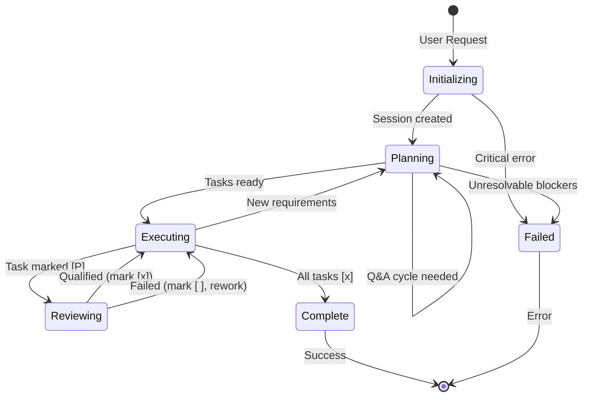

# Ralph Orchestrator State Machine

This document models the Ralph orchestrator as a finite state machine, designed for straightforward implementation in C# or any statically-typed language.

---

## State Machine Diagram



---

## States

| State            | Description                               | Entry Condition                        | Owner          |
| ---------------- | ----------------------------------------- | -------------------------------------- | -------------- |
| **Initializing** | Session setup, determine new vs resume    | User request received                  | Orchestrator   |
| **Planning**     | Create/update plan, tasks, coordinate Q&A | Session resolved                       | Ralph-Planner  |
| **Executing**    | Implement a single task                   | Tasks ready, next task identified      | Ralph-Executor |
| **Reviewing**    | Validate task against success criteria    | Task marked `[P]`                      | Ralph-Reviewer |
| **Complete**     | All tasks done, goals met                 | All tasks `[x]`, holistic check passed | Orchestrator   |
| **Failed**       | Unrecoverable error                       | Critical blocker, max retries exceeded | Orchestrator   |

---

## Transitions

### From Initializing

| Condition      | Target State          | Action                                                      |
| -------------- | --------------------- | ----------------------------------------------------------- |
| New session    | Planning              | Create session directory, invoke Ralph-Planner (INITIALIZE) |
| Resume session | Planning or Executing | Read progress.md, determine next action                     |
| Critical error | Failed                | Log error, exit                                             |

### From Planning

| Condition                        | Target State | Action                                     |
| -------------------------------- | ------------ | ------------------------------------------ |
| Planner requests Q&A cycle       | Planning     | Invoke Ralph-Questioner, return to planner |
| Tasks ready (tasks.md populated) | Executing    | Read progress.md, select next task         |
| Unresolvable blockers            | Failed       | Log blockers, prompt user                  |
| New requirements from user       | Planning     | Invoke Ralph-Planner (UPDATE)              |

### From Executing

| Condition                   | Target State | Action                        |
| --------------------------- | ------------ | ----------------------------- |
| Executor marks task `[P]`   | Reviewing    | Invoke Ralph-Reviewer         |
| Executor blocked            | Planning     | Add corrective tasks, re-plan |
| All tasks `[x]`             | Complete     | Run holistic goal check       |
| New requirements discovered | Planning     | Invoke Ralph-Planner (UPDATE) |

### From Reviewing

| Condition            | Target State | Action                                       |
| -------------------- | ------------ | -------------------------------------------- |
| Verdict: Qualified   | Executing    | Mark `[P]` → `[x]`, select next task         |
| Verdict: Failed      | Executing    | Mark `[P]` → `[ ]`, increment rework counter |
| New tasks discovered | Executing    | Add to tasks.md and progress.md              |

### From Complete

| Condition             | Target State | Action                      |
| --------------------- | ------------ | --------------------------- |
| Holistic check passed | Exit         | Return success summary      |
| Holistic check failed | Planning     | Add missing tasks, continue |

---

## State Data Model

```csharp
public record OrchestratorState
{
    public State CurrentState { get; init; }
    public string SessionId { get; init; }
    public string SessionPath { get; init; }
    public string? CurrentTaskId { get; init; }
    public int CurrentAttemptNumber { get; init; }
    public List<string> Blockers { get; init; } = new();
    public int QaCycleCount { get; init; }
}

public enum State
{
    Initializing,
    Planning,
    Executing,
    Reviewing,
    Complete,
    Failed
}
```

---

## Transition Logic (Pseudocode)

```
function nextState(currentState, event):
    match currentState:
        Initializing:
            if event.type == "session_resolved":
                if event.isNewSession:
                    invoke Ralph-Planner(MODE: INITIALIZE)
                    return Planning
                else:
                    progress = read progress.md
                    if progress.hasUncompletedTasks:
                        return Executing
                    else:
                        return Complete
            if event.type == "error":
                return Failed
                
        Planning:
            if event.type == "planner_completed":
                if event.output.status == "needs_qa_cycle":
                    invoke Ralph-Questioner
                    invoke Ralph-Planner(MODE: QA_COORDINATE)
                    return Planning  // loop
                if event.output.status == "completed":
                    return Executing
                if event.output.status == "blocked":
                    return Failed
                    
        Executing:
            if event.type == "no_tasks_remaining":
                return Complete
            if event.type == "task_selected":
                invoke Ralph-Executor(TASK_ID, ATTEMPT_NUMBER)
                // wait for completion
            if event.type == "executor_completed":
                if event.output.status == "completed":
                    return Reviewing
                if event.output.status == "blocked":
                    return Planning  // re-plan
                    
        Reviewing:
            if event.type == "reviewer_completed":
                if event.output.verdict == "Qualified":
                    update progress.md: [P] -> [x]
                    return Executing
                if event.output.verdict == "Failed":
                    update progress.md: [P] -> [ ]
                    incrementAttemptNumber()
                    return Executing
                    
        Complete:
            if event.type == "holistic_check_passed":
                return Exit(success)
            if event.type == "holistic_check_failed":
                invoke Ralph-Planner(MODE: UPDATE)
                return Planning
```

---

## Implementation Patterns

### VS Code Implementation

In VS Code, the orchestrator is a `.agent.md` file that uses `runSubagent` tool calls. The state machine logic is embedded in the prompt:

```markdown
## Workflow
1. Read progress.md to determine current state
2. Based on state, invoke appropriate subagent
3. Process response, update state files
4. Loop until Complete or Failed
```

The "state" is implicitly stored in:
- `progress.md` (which tasks are done)
- Presence/absence of artifacts
- Task report files (for rework detection)

### SDK Implementation

In the SDK, the orchestrator is explicit C# code:

```csharp
public class RalphOrchestrator
{
    private OrchestratorState _state;
    
    public async Task<Result> RunAsync(string userRequest)
    {
        _state = new OrchestratorState { CurrentState = State.Initializing };
        
        while (_state.CurrentState != State.Complete && 
               _state.CurrentState != State.Failed)
        {
            _state = await ProcessStateAsync(_state);
        }
        
        return new Result(_state);
    }
    
    private async Task<OrchestratorState> ProcessStateAsync(OrchestratorState state)
    {
        return state.CurrentState switch
        {
            State.Initializing => await HandleInitializingAsync(state),
            State.Planning => await HandlePlanningAsync(state),
            State.Executing => await HandleExecutingAsync(state),
            State.Reviewing => await HandleReviewingAsync(state),
            State.Complete => await HandleCompleteAsync(state),
            _ => state with { CurrentState = State.Failed }
        };
    }
}
```

---

## Error Handling

### Retry Policy

```csharp
public class RetryPolicy
{
    public int MaxTaskAttempts { get; } = 3;
    public int MaxQaCycles { get; } = 3;
    public int MaxPlanningRetries { get; } = 2;
    
    public bool ShouldRetryTask(int attemptNumber) => attemptNumber < MaxTaskAttempts;
    public bool ShouldContinueQa(int cycleNumber) => cycleNumber < MaxQaCycles;
}
```

### Failure Conditions

| Condition           | State  | Recovery                  |
| ------------------- | ------ | ------------------------- |
| Task failed 3 times | Failed | Log, prompt user          |
| Planner blocked     | Failed | Log blockers, prompt user |
| Network error       | Retry  | Exponential backoff       |
| Invalid response    | Retry  | Re-invoke subagent        |

---

## Observability

### State Transitions Log

```json
{
  "timestamp": "2026-01-31T15:00:00Z",
  "sessionId": "260131-144400",
  "transition": {
    "from": "Executing",
    "to": "Reviewing",
    "trigger": "executor_completed",
    "taskId": "task-1",
    "attemptNumber": 1
  }
}
```

### Metrics to Track

- Time in each state
- Task success/failure rates
- Rework frequency
- Q&A cycle counts
- End-to-end session duration

---

## Testing State Transitions

```csharp
[TestMethod]
public async Task WhenExecutorCompletes_ThenTransitionsToReviewing()
{
    // Arrange
    var state = new OrchestratorState
    {
        CurrentState = State.Executing,
        CurrentTaskId = "task-1",
        CurrentAttemptNumber = 1
    };
    
    var executorOutput = new ExecutorOutput
    {
        Status = "completed",
        SuccessCriteriaMet = true
    };
    
    // Act
    var nextState = stateMachine.Transition(state, executorOutput);
    
    // Assert
    Assert.AreEqual(State.Reviewing, nextState.CurrentState);
}

[TestMethod]
public async Task WhenReviewerQualifies_ThenTransitionsToExecuting()
{
    // Arrange
    var state = new OrchestratorState
    {
        CurrentState = State.Reviewing,
        CurrentTaskId = "task-1"
    };
    
    var reviewerOutput = new ReviewerOutput
    {
        Verdict = "Qualified"
    };
    
    // Act
    var nextState = stateMachine.Transition(state, reviewerOutput);
    
    // Assert
    Assert.AreEqual(State.Executing, nextState.CurrentState);
    Assert.IsNull(nextState.CurrentTaskId); // cleared for next selection
}
```

---

## References

- [Ralph Orchestrator Agent](../../agents/ralph.agent.md)
- [Ralph Subagent Contracts](../reference/ralph-subagent-contracts.md)
- [Ralph SDK Migration Guide](../reference/ralph-sdk-migration.md)
