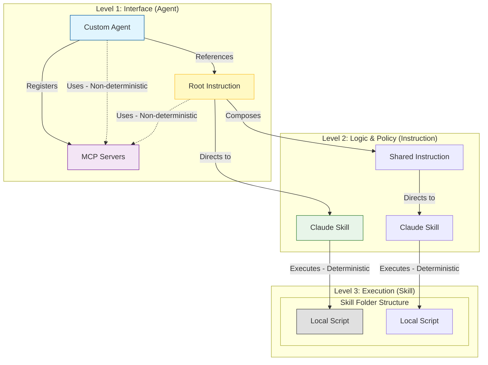

# ADR: Agent -> Instruction -> Skill Architectural Pattern

## Context

We are currently using "Monolithic Agents" where all logic, persona, and workflow definitions reside in a single `.agent.md` file. This leads to:
- **Duplication**: Common workflows (like "Git Commit Standards") are repeated across agents.
- **Context Limits**: Large agent definitions consume context window even when parts aren't needed.
- **Maintenance Overhead**: Updating a shared process requires editing multiple agent files.

## Decision

We will adopt a **Composed Architecture** pattern that strictly separates concerns into three hierarchical levels, with specific rules for tooling and determinism:

### Level 1: Custom Agent (`*.agent.md`)

- **Role**: The **Orchestrator** & **Interface**.
- **Responsibility**: Defines the Persona and Mission. Registers **MCP Servers**.
- **Tooling**: Can directly reference MCP tools for steering (Non-deterministic).
- **Dependency**: `Agent -> Instruction`

### Level 2: Custom Instruction (`*.instructions.md`)

- **Role**: The **Policy Maker**.
- **Responsibility**: Defines the Workflow and Business Logic.
- **Tooling**: Can reference MCP tools for intermediate steps (Non-deterministic).
- **Dependency**: `Instruction -> Skill` or `Instruction -> Instruction`

### Level 3: Claude Skill (`skills/*/SKILL.md`)

- **Role**: The **Executor**.
- **Responsibility**: Defines the Mechanism for deterministic execution.
- **Tooling**: Tightly coupled **Scripts** (Python/PowerShell) located in a `scripts/` subfolder.
- **Nature**: "Hard" skills with predictable outputs.

## Tooling & Determinism

- **MCP Servers**: Registered at the Agent level. Used by Agents and Instructions for broad, flexible tasks (e.g., "Search the web", "Query database"). Output is variable (Non-deterministic).
- **Scripts**: Tightly coupled to a specific Skill. Located in `skills/<skill-name>/scripts/`. Used for precise, repeatable tasks (e.g., "Calculate Tax", "Generate PDF"). Output is fixed (Deterministic).

## Visual Model



## Implementation Strategy

Since VS Code Copilot does not have a native `#include` directive, we use **Semantic Linking**.

**Syntax:**
Use standard Markdown links with directive verbs to "load" context on demand.

1. **Agent → Instruction**:
    > "Follow the workflow defined in [Issue Writing Instructions](instructions/issue-writing.instructions.md)."

2. **Instruction → Skill**:
    > "To generate the file, execute the [Issue Writer Skill](skills/issue-writer/SKILL.md)."

## Example Refactor: Issue-Writer

**Before**: All logic in `agents/issue-writer.agent.md`.

**After**:

1. **The Agent** (`agents/issue-writer.agent.md`):

    ```markdown
    # Issue Writer Agent
    You are the **Issue Writer**.
    ## Mission
    Analyze requests and create documentation.
    ## Instructions
    Strictly follow: [Issue Writing Instructions](instructions/issue-writing.instructions.md)
    ```

2. **The Instruction** (`instructions/issue-writing.instructions.md`):

    ```markdown
    # Issue Writing Workflow
    ## Metadata Standard
    (Logic moved here...)
    ## Execution
    Use: [Issue Writer Skill](skills/issue-writer/SKILL.md)
    ```

3. **The Skill** (`skills/issue-writer/SKILL.md`):
    *(Remains unchanged, containing the `create_issue.py` script usage)*

## Consequences

**Positive:**
- **Separation of Concerns**: Clear boundaries between "Who" (Agent), "How" (Instruction), and "What" (Skill).
- **DRY (Don't Repeat Yourself)**: Instructions like "Git Standards" can be written once and referenced by multiple agents.
- **Scalability**: Easier to manage small, focused files than massive prompts.
- **Determinism**: Pushing complex execution logic down to Skills (and scripts) increases reliability.

**Negative:**
- **Complexity**: Requires managing dependencies across multiple files.
- **Navigation**: The Agent (and developer) must follow links to understand the full behavior.