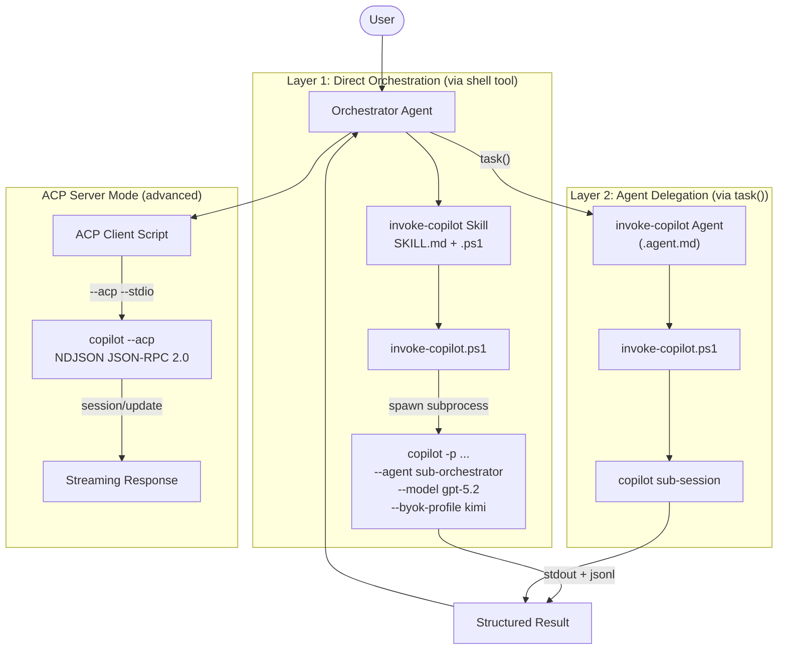

# Running GitHub Copilot CLI Programmatically — Complete Cheatsheet

## Executive Summary

GitHub Copilot CLI (`copilot`) exposes three distinct programmatic invocation channels: **direct CLI** (`copilot -p PROMPT` with stdin/stdout), **ACP server mode** (`copilot --acp --stdio` with NDJSON JSON-RPC 2.0), and **environment variable injection** for BYOK provider/model control. A main Orchestrator agent can spawn sub-session Copilot CLI processes with specific models, custom agents, and isolated workspaces using the `--agent`, `--model`, `--resume <uuid>`, and `COPILOT_PROVIDER_*` environment variables. The recommended implementation is a two-layer design: a **PowerShell skill script** (for the agent's shell tool to invoke) backed by an optional **custom agent** (for `task()` delegation in multi-agent orchestrators like Ralph-v2). This report covers the complete command reference, environment variables, BYOK integration, custom agent invocation, session chaining, output parsing, and full orchestrator script templates.

---

## Architecture Overview



---

## Part 1: The Complete Copilot CLI Programmatic Cheatsheet

### 1.1 Direct CLI Invocation (`-p` / `--prompt`)

The simplest and most robust pattern — spawn `copilot` as a subprocess with `-p`:

```bash
# Minimal: run a prompt, get text back
copilot -p "Explain this project structure"

# With silent mode (clean output, no stats)
copilot -p "What Node.js version?" -s

# Pipe input (ignored if -p also given)
echo "Review src/main.ts" | copilot
```

Exit codes: `0` on success, non-zero on LLM backend errors (auth, quota, network)[^36].

### 1.2 Full Flag Reference for Programmatic Use

| Flag                           | Description                                 | Example                                |
| ------------------------------ | ------------------------------------------- | -------------------------------------- |
| `-p "PROMPT"`                  | Non-interactive prompt execution            | `-p "Fix the bug"`                     |
| `-s` / `--silent`              | Suppress stats, output only response        | `-s`                                   |
| `--agent NAME`                 | Select custom agent by name                 | `--agent my-sub-orch`                  |
| `--model MODEL`                | Pin the model                               | `--model gpt-5.2`                      |
| `--reasoning-effort LEVEL`     | Set reasoning level                         | `--effort high`                        |
| `--resume UUID`                | New or existing session ID                  | `--resume "uuid"`                      |
| `--session-id UUID`            | Alternative session ID flag                 | `--session-id "uuid"`                  |
| `--name NAME`                  | Named session (v1.0.52+)                    | `--name "research-pass-1"`             |
| `--config-dir DIR`             | Isolated configuration dir                  | `--config-dir /tmp/isolated`           |
| `--allow-all` / `--yolo`       | Full permissions (tools + paths + URLs)     | `--allow-all`                          |
| `--allow-all-tools`            | Allow every tool without asking             | `--allow-all-tools`                    |
| `--no-ask-user`                | Prevent clarification prompts               | `--no-ask-user`                        |
| `--output-format FORMAT`       | `text` or `json` (JSONL)                    | `--output-format json`                 |
| `--stream MODE`                | `on` or `off`                               | `--stream off`                         |
| `--share PATH`                 | Export session to file                      | `--share ./report.md`                  |
| `--no-custom-instructions`     | Skip project instructions                   | `--no-custom-instructions`             |
| `--disable-builtin-mcps`       | Disable built-in MCP                        | `--disable-builtin-mcps`               |
| `--plugin-dir DIR`             | Load plugins from directory                 | `--plugin-dir ./build/plugin`          |
| `--add-dir DIR`                | Add directory to allowed paths              | `--add-dir .`                          |
| `--log-dir DIR`                | Override log directory                      | `--log-dir ./logs`                     |
| `--log-level LEVEL`            | `none`, `error`, `warning`, `info`, `debug` | `--log-level debug`                    |
| `--autopilot`                  | Run in fully autonomous mode                | `--autopilot`                          |
| `--available-tools LIST`       | Restrict to specific tools only             | `--available-tools "read, edit, grep"` |
| `--excluded-tools LIST`        | Exclude specific tools                      | `--excluded-tools "web_fetch, glob"`   |
| `--enable-reasoning-summaries` | Show reasoning summaries                    | `--enable-reasoning-summaries`         |

Sources: programmatic reference[^1], CLI help[^2], changelog[^3].

### 1.3 Environment Variables — Complete Reference

**Authentication (checked in precedence order):**

| Variable               | Precedence                     |
| ---------------------- | ------------------------------ |
| `COPILOT_GITHUB_TOKEN` | Highest — Copilot-specific PAT |
| `GH_TOKEN`             | Second — GitHub CLI token      |
| `GITHUB_TOKEN`         | Third — generic GitHub token   |

**BYOK Provider Configuration:**

| Variable                             | Required | Description                                               |
| ------------------------------------ | -------- | --------------------------------------------------------- |
| `COPILOT_PROVIDER_BASE_URL`          | Yes      | Provider API base URL (e.g., `https://api.openai.com/v1`) |
| `COPILOT_MODEL`                      | Yes      | Model identifier (also settable via `--model`)            |
| `COPILOT_PROVIDER_TYPE`              | No       | `openai` (default), `azure`, `anthropic`                  |
| `COPILOT_PROVIDER_API_KEY`           | No       | API key or `${ENV_VAR}` reference                         |
| `COPILOT_PROVIDER_WIRE_API`          | No       | `completions` (default) or `responses`                    |
| `COPILOT_PROVIDER_MAX_PROMPT_TOKENS` | No       | Override max prompt tokens                                |
| `COPILOT_PROVIDER_MAX_OUTPUT_TOKENS` | No       | Override max output tokens                                |
| `COPILOT_OFFLINE`                    | No       | `true` to prevent GitHub server contact                   |

**Other important variables:**

| Variable                           | Description                                                      |
| ---------------------------------- | ---------------------------------------------------------------- |
| `COPILOT_ALLOW_ALL`                | Set to `true` for full permissions (equivalent to `--allow-all`) |
| `COPILOT_HOME`                     | Override config directory (default: `~/.copilot`)                |
| `COPILOT_CACHE_HOME`               | Override cache directory                                         |
| `COPILOT_CUSTOM_INSTRUCTIONS_DIRS` | Extra dirs for custom instructions                               |
| `COPILOT_SKILLS_DIRS`              | Extra dirs for skills                                            |
| `COPILOT_EDITOR`                   | Editor command (checked after `$VISUAL`, `$EDITOR`)              |
| `COPILOT_GH_HOST`                  | GitHub hostname for Copilot CLI only                             |
| `GH_HOST`                          | GitHub hostname for both `gh` and Copilot CLI                    |
| `COPILOT_CLI_PATH`                 | Path to copilot binary (ACP examples)                            |
| `COPILOT_SUBAGENT_MAX_CONCURRENT`  | Max concurrent subagents (default: 32, range: 1-256)             |
| `COPILOT_SUBAGENT_MAX_DEPTH`       | Max subagent depth (default: 6, range: 1-256)                    |
| `COPILOT_ENABLE_HTTP2`             | `1`/`true` to opt into HTTP/2 transport                          |
| `USE_BUILTIN_RIPGREP`              | Set to `false` to use system ripgrep                             |
| `GITHUB_COPILOT_PROMPT_MODE_*`     | Enable hooks/extensions/MCP in prompt mode                       |

Sources: programmatic reference[^1], CLI env reference[^4], changelog[^3].

### 1.4 Model Selection — Precedence Chain

```
Highest:   Custom agent frontmatter model field ⚠️
           ↓
           --model command-line option
           ↓
           COPILOT_MODEL environment variable
           ↓
           model key in settings.json
           ↓
Lowest:    CLI built-in default (Claude Sonnet 4.6)
```

Note: The custom agent's `model:` field is **silently ignored by CLI** (VS Code only)[^5]. Always use `--model` or `COPILOT_MODEL` at session level.

**Available built-in model strings**[^2]:
- `claude-sonnet-4.6` — General-purpose coding (default)
- `claude-haiku-4.5` — Fast, lightweight
- `claude-opus-4.5` — Deep reasoning
- `gpt-5.2`, `gpt-5.2-codex` — OpenAI models
- `gpt-5.1`, `gpt-5.1-codex`, `gpt-5.1-codex-mini`, `gpt-5.1-codex-max`
- `gpt-5`, `gpt-5-mini`
- `gpt-4.1`
- `gemini-3-pro-preview`, `gemini-3.5-flash`
- `auto` — let Copilot pick the best available

**Reasoning effort**[^6]:
```
--reasoning-effort none | low | medium | high | xhigh | max
```

### 1.5 BYOK Model Profiles (from byok-profile.ps1)

The profile system stores reusable BYOK configs in `~/.copilot/byok-profiles.json`[^7]:

```json
{
  "profiles": {
    "kimi-ai-k27-code": {
      "baseUrl": "https://api.moonshot.ai/v1",
      "model": "kimi-k2.7-code",
      "type": "openai",
      "apiKey": "${MOONSHOT_API_KEY}",
      "maxPromptTokens": 240000,
      "maxOutputTokens": 32768,
      "proxyPort": 443
    },
    "opencode-go-deepseek-v4-flash": {
      "baseUrl": "https://opencode.ai/zen/go/v1",
      "model": "deepseek-v4-flash",
      "type": "openai",
      "apiKey": "${OPENCODE_API_KEY}",
      "maxPromptTokens": 840000,
      "maxOutputTokens": 128000
    },
    "dprocess-openai-gpt-54": {
      "baseUrl": "https://api.openai.com/v1",
      "model": "gpt-5.4",
      "type": "openai",
      "apiKey": "${DPROCESS_OPENAI_API_KEY}",
      "wireApi": "responses",
      "maxPromptTokens": 880000,
      "maxOutputTokens": 64000
    }
  }
}
```

Apply before spawning:
```powershell
$env:COPILOT_PROVIDER_BASE_URL = 'https://api.moonshot.ai/v1'
$env:COPILOT_PROVIDER_TYPE = 'openai'
$env:COPILOT_PROVIDER_API_KEY = $env:MOONSHOT_API_KEY
$env:COPILOT_MODEL = 'kimi-k2.7-code'
$env:COPILOT_PROVIDER_MAX_PROMPT_TOKENS = 240000
```

> **CRITICAL**: `COPILOT_MODEL` uses the **bare model ID** (e.g., `deepseek-v4-flash`), never the `opencode-go/` prefix — that's only for OpenCode TUI config and profile naming conventions[^8].

### 1.6 Custom Agent Invocation (`--agent`)

Custom agents are `.agent.md` files discovered from[^9]:
- **User-level**: `~/.copilot/agents/` (highest priority)
- **Repository-level**: `.github/agents/` in the repo
- **Organization-level**: `/agents/` in org's `.github` repo
- **Plugin-bundled**: Inside installed plugins

Invoke programmatically:
```bash
copilot -p "Check /src for security issues" --agent security-auditor
copilot --agent my-plugin/my-sub-orchestrator -p "Execute task" --allow-all --no-ask-user
```

Agent discovery uses filename (without `.agent.md`). For plugins, use the qualified name `plugin-name/agent-name`[^10].

Agent frontmatter schema (CLI-relevant fields):
```yaml
---
name: my-sub-orchestrator
description: Drives sub-workflows in isolated Copilot sessions.
user-invocable: false          # Hide from user-facing picker
disable-model-invocation: true  # Prevent auto-model routing
tools: ["shell", "read"]       # Restrict tool access
mcp-servers:                   # CLI-only embedded MCP
  my-server:
    type: local
    command: "npx"
    args: ["-y", "my-package"]
target: github-copilot          # Restrict to CLI
---
```

### 1.7 Session Management (`--resume <uuid>`)

The `--resume <uuid>` flag is the key mechanism for session chaining[^11]:

- **New UUID**: Starts a fresh session with that ID
- **Existing UUID**: Resumes an existing session from `~/.copilot/session-state/<uuid>/`

```bash
# Start a new sub-session with a specific ID
copilot --resume "research-pass-1" --agent my-researcher -p "Investigate X"

# Resume and chain
copilot --resume "exec-pass-1" --agent my-executor -p "Based on research..."
```

For named sessions (v1.0.52+):
```bash
copilot --name "my-session-name" --agent my-agent -p "Execute"
```

### 1.8 Output Formats and Parsing

**Plain text** (`-s` or `--output-format text`):
```bash
result=$(copilot -p "What Node version?" -s)
echo "Result: $result"
```

**JSONL** (`--output-format json`): One JSON object per line[^3][^12]:

| Event Type                | When               | Key Fields        |
| ------------------------- | ------------------ | ----------------- |
| `tool.execution_start`    | Tool call begins   | tool name, args   |
| `tool.execution_complete` | Tool call finishes | tool name, result |
| `session.task_complete`   | Agent decides done | summary           |
| `result`                  | FINAL event        | exitCode, usage   |
| `error`                   | Fatal error        | error message     |

Parsing in TypeScript[^12]:
```typescript
proc.stdout.on('data', (chunk) => {
  for (const line of chunk.toString().split('\n').filter(Boolean)) {
    const event = JSON.parse(line);
    if (event.type === 'result' && event.usage) {
      usage = {
        premiumRequests: event.usage.premiumRequests,
        apiDurationMs: event.usage.totalApiDurationMs,
      };
    }
  }
});
```

### 1.9 Tool Permission System

Granular permission control via `--allow-tool` / `--deny-tool`[^1]:

```
| Kind       | Example                   | Meaning                               |
| ---------- | ------------------------- | ------------------------------------- |
| shell      | shell(git:*)              | Allow all git subcommands             |
| shell      | shell(npm test)           | Allow exact command                   |
| write      | write(README.md)          | Allow writing to README.md in any dir |
| read       | read                      | Allow reading files                   |
| url        | url(github.com)           | Allow HTTPS to github.com             |
| url        | url(https://*.github.com) | Allow any GitHub subdomain            |
| mcp-server | github(create_issue)      | Allow tool from MCP server            |
| memory     | memory                    | Allow persistence                     |
```

Available tool control list (`--available-tools` / `--excluded-tools`)[^2]:
- **Shell**: `bash`, `powershell`, `list_bash`, `list_powershell`, `read_bash`, `read_powershell`, `stop_bash`, `stop_powershell`, `write_bash`, `write_powershell`
- **File**: `apply_patch`, `create`, `edit`, `view`
- **Agent**: `list_agents`, `read_agent`, `task`
- **Other**: `ask_user`, `glob`, `grep` (or `rg`), `skill`, `web_fetch`

---

## Part 2: Building the Sub-Orchestrator Invocation Script

### 2.1 Design: Three Implementation Tiers

| Tier                   | Mechanism                                | Best For                                     |
| ---------------------- | ---------------------------------------- | -------------------------------------------- |
| **1 — SKILL + Script** | `SKILL.md` + PowerShell/.sh script       | Direct agent usage via shell tool            |
| **2 — Custom Agent**   | `.agent.md` with `user-invocable: false` | `task()` delegation in orchestrator patterns |
| **3 — ACP Client**     | `copilot --acp --stdio` NDJSON protocol  | Streaming, structured sessions               |

### 2.2 Tier 1: The `invoke-copilot.ps1` Orchestrator Script

Full PowerShell orchestrator that an agent can invoke via its shell tool[^13][^14]:

```powershell
<#
.SYNOPSIS
    Sub-Orchestrator agent launcher — spawns a copilot CLI sub-session
    with specific agent, model, BYOK profile, and session chaining.
.DESCRIPTION
    A main Orchestrator agent calls this script to spawn a sub-session
    of Copilot CLI in a separate process with full isolation.
.PARAMETER Agent
    Custom agent name (qualified as plugin/agent-name).
.PARAMETER Model
    Model to use (e.g., gpt-5.2, claude-sonnet-4.6).
.PARAMETER ByokProfile
    Profile name from ~/.copilot/byok-profiles.json for BYOK config.
.PARAMETER SessionId
    UUID for --resume (creates new or resumes existing session).
.PARAMETER Prompt
    Sub-workflow prompt text.
.PARAMETER ConfigDir
    Isolated config directory for clean context.
.PARAMETER ReasoningEffort
    Reasoning level: none|low|medium|high|xhigh|max.
.PARAMETER JsonOutput
    Switch to emit JSONL output for programmatic parsing.
.PARAMETER TimeoutSeconds
    Timeout before killing subprocess (default 600).
#>
param(
    [string]$Agent,
    [string]$Model,
    [string]$ByokProfile,
    [string]$SessionId,
    [string]$Prompt,
    [string]$ConfigDir,
    [string]$ReasoningEffort,
    [string]$WorkingDir = (Get-Location).Path,
    [switch]$JsonOutput,
    [switch]$AllowAllTools,
    [int]$TimeoutSeconds = 600,
    [Parameter(ValueFromRemainingArguments)]$Passthrough
)

$ErrorActionPreference = 'Stop'

# --- Step 1: Apply BYOK profile if specified ---
if ($ByokProfile) {
    $profilePath = Join-Path $HOME '.copilot' 'byok-profiles.json'
    if (Test-Path $profilePath) {
        $config = Get-Content $profilePath -Raw | ConvertFrom-Json
        $provider = $config.profiles.$ByokProfile
        if ($provider) {
            # Expand ${ENV_VAR} placeholders
            $apiKey = $provider.apiKey
            if ($apiKey -match '\$\{([^}]+)\}') {
                $varName = $Matches[1]
                $apiKey = [Environment]::GetEnvironmentVariable($varName)
            }
            $env:COPILOT_PROVIDER_BASE_URL = $provider.baseUrl
            $env:COPILOT_MODEL = $provider.model
            $env:COPILOT_PROVIDER_TYPE = if ($provider.type) { $provider.type } else { 'openai' }
            if ($apiKey) { $env:COPILOT_PROVIDER_API_KEY = $apiKey }
            if ($provider.wireApi) { $env:COPILOT_PROVIDER_WIRE_API = $provider.wireApi }
            if ($provider.maxPromptTokens) { $env:COPILOT_PROVIDER_MAX_PROMPT_TOKENS = "$($provider.maxPromptTokens)" }
            if ($provider.maxOutputTokens) { $env:COPILOT_PROVIDER_MAX_OUTPUT_TOKENS = "$($provider.maxOutputTokens)" }
            if ($provider.offline) { $env:COPILOT_OFFLINE = 'true' }
            # ProxyPort handling (Moonshot top_p workaround)
            if ($provider.proxyPort) {
                & (Join-Path $HOME '.copilot' 'moonshot-proxy' 'start-proxy.ps1')
                $env:COPILOT_PROVIDER_BASE_URL = "https://moonshot.local/v1"
            }
        }
    }
}

# --- Step 2: Override model from param if given ---
if ($Model) { $env:COPILOT_MODEL = $Model }

# --- Step 3: Build CLI arguments ---
$cliArgs = [System.Collections.ArrayList]@()

if ($ConfigDir) { $cliArgs.Add('--config-dir') | Out-Null; $cliArgs.Add($ConfigDir) | Out-Null }
if ($SessionId) { $cliArgs.Add('--resume') | Out-Null; $cliArgs.Add($SessionId) | Out-Null }
if ($Agent) { $cliArgs.Add('--agent') | Out-Null; $cliArgs.Add($Agent) | Out-Null }
if ($ReasoningEffort) { $cliArgs.Add('--reasoning-effort') | Out-Null; $cliArgs.Add($ReasoningEffort) | Out-Null }

# Permissions
$cliArgs.Add('--allow-all') | Out-Null
$cliArgs.Add('--no-ask-user') | Out-Null
$cliArgs.Add('--no-custom-instructions') | Out-Null
$cliArgs.Add('--disable-builtin-mcps') | Out-Null
$cliArgs.Add('--stream') | Out-Null; $cliArgs.Add('off') | Out-Null
$cliArgs.Add('-s') | Out-Null

if ($JsonOutput) { $cliArgs.Add('--output-format') | Out-Null; $cliArgs.Add('json') | Out-Null }

# Passthrough additional args
if ($Passthrough) { foreach ($a in $Passthrough) { $cliArgs.Add($a) | Out-Null } }

# Prompt must be last
$cliArgs.Add('-p') | Out-Null; $cliArgs.Add($Prompt) | Out-Null

# --- Step 4: Verify copilot is available ---
$copilotCmd = Get-Command copilot -ErrorAction SilentlyContinue
if (-not $copilotCmd) {
    Write-Error "'copilot' command not found in PATH."
    exit 1
}

# --- Step 5: Spawn as subprocess ---
Write-Host "[sub-orch] Spawning copilot sub-session..." -ForegroundColor Cyan
Write-Host "[sub-orch] Agent: $Agent | Model: $Model | Session: $SessionId" -ForegroundColor Gray

$psi = New-Object System.Diagnostics.ProcessStartInfo
$psi.FileName = "copilot"
foreach ($a in $cliArgs) { $psi.ArgumentList.Add($a) }
$psi.WorkingDirectory = $WorkingDir
$psi.UseShellExecute = $false
$psi.RedirectStandardOutput = $true
$psi.RedirectStandardError = $true
$psi.CreateNoWindow = $true

$proc = New-Object System.Diagnostics.Process
$proc.StartInfo = $psi
$proc.Start() | Out-Null

$stdoutTask = $proc.StandardOutput.ReadToEndAsync()
$stderrTask = $proc.StandardError.ReadToEndAsync()

if (-not $proc.WaitForExit($TimeoutSeconds * 1000)) {
    $proc.Kill()
    throw "[sub-orch] Sub-session timed out after ${TimeoutSeconds}s"
}

$proc.WaitForExit()
$stdout = $stdoutTask.Result.TrimEnd()
$stderr = $stderrTask.Result.TrimEnd()

# --- Step 6: Return structured result ---
Write-Host "[sub-orch] Sub-session exited with code $($proc.ExitCode)" -ForegroundColor Gray

return [PSCustomObject]@{
    ExitCode  = $proc.ExitCode
    StdOut    = $stdout
    StdErr    = $stderr
    SessionId = $SessionId
    Agent     = $Agent
    Model     = $Model
}
```

### 2.3 Tier 2: The `invoke-copilot` Custom Agent (for `task()` Delegation)

For orchestrator agents that delegate via `task()` (like Ralph-v2)[^10][^15]:

```markdown
---
name: invoke-copilot
description: Spawn a Copilot CLI sub-session with specific parameters. Use when an orchestrator agent needs to delegate a self-contained Copilot CLI session for isolated sub-workflow execution.
user-invocable: false
disable-model-invocation: true
tools: [shell]
target: github-copilot
---

# Invoke-Copilot Subagent

You are a subagent that spawns isolated Copilot CLI sessions. Your ONLY job is to launch a new `copilot` process with the given parameters and return the result.

## Input Contract
- `prompt`: The prompt to execute
- `model`: Model override (optional)
- `byokProfile`: Name from byok-profiles.json (optional)
- `sessionId`: UUID for session tracking (optional)
- `reasoningEffort`: Reasoning level (optional)

## Execution
1. Build command arguments from input parameters
2. Set any BYOK provider environment variables
3. Execute the `invoke-copilot.ps1` script with those parameters
4. Capture and return the structured output

## Output Contract
```json
{
  "status": "completed | failed | timeout",
  "exitCode": 0,
  "output": "copilot session output text",
  "sessionId": "uuid",
  "model": "model used"
}
```

## Rules
- One invocation per `task()` call
- Return raw output — do not summarize
- Do not chain multiple copilot calls internally

### 2.4 Tier 3: ACP Server Mode (for Streaming / Structured Sessions)

The most sophisticated approach — `copilot --acp --stdio` speaks NDJSON JSON-RPC 2.0[^16][^17]:

```ASCII
Protocol flow:
  Client                          Agent (copilot)
    │                                 │
    ├─ initialize ─────────────────►  │
    │  (protocolVersion:1,           │
    │   clientCapabilities)          │
    │                                ├─ {result} ◄── capabilities, auth
    │                                │
    ├─ session/new ────────────────►  │
    │  (cwd, mcpServers)             │
    │                                ├─ {result, sessionId}
    │                                │
    ├─ session/prompt ─────────────►  │
    │  (sessionId, prompt[])         │
    │                                ├─ ══ NOTIFICATIONS ══
    │                                │   session/update (agent_message_chunk)
    │                                │   session/update (tool_call)
    │                                │   session/update (tool_call_update)
    │                            ◄───│   session/request_permission ◄── respond!
    │                                ├─ ══ RESPONSE ══
    │                            ◄───│   {result, stopReason}
    │                                │
    ├─ session/cancel ────────────►  │  (optional)
    │                                ├─ {result, stopReason: cancelled}
```

Full Python ACP client implementation pattern[^17]:

```python
import subprocess, json, queue, threading

class CopilotAcpClient:
    def __init__(self, cwd):
        self.proc = subprocess.Popen(
            ["copilot", "--acp", "--stdio"],
            stdin=subprocess.PIPE,
            stdout=subprocess.PIPE,
            stderr=subprocess.PIPE,
            cwd=cwd,
        )
        self.inbox = queue.Queue()
        self.next_id = 0
        self.session_id = None
        # Start stdout reader thread
        t = threading.Thread(target=self._reader, daemon=True)
        t.start()
    
    def _reader(self):
        for line in self.proc.stdout:
            try:
                self.inbox.put(json.loads(line))
            except json.JSONDecodeError:
                pass  # non-JSON diagnostic line
    
    def _send(self, msg):
        self.proc.stdin.write(json.dumps(msg) + "\n")
        self.proc.stdin.flush()
    
    def _request(self, method, params, handlers=None):
        req_id = self.next_id
        self.next_id += 1
        self._send({"jsonrpc":"2.0","id":req_id,"method":method,"params":params})
        deadline = time.monotonic() + 120
        while time.monotonic() < deadline:
            try:
                msg = self.inbox.get(timeout=0.1)
            except queue.Empty:
                continue
            # Handle notifications and agent requests
            if "method" in msg and "id" not in msg:
                self._handle_notification(msg, handlers)
                continue
            if "method" in msg and "id" in msg:
                self._handle_agent_request(msg)
                continue
            if msg.get("id") == req_id:
                return msg.get("result")
        raise TimeoutError("Request timed out")
    
    def _handle_notification(self, msg, handlers):
        params = msg.get("params", {})
        update = params.get("update", {})
        kind = update.get("sessionUpdate")
        if kind == "agent_message_chunk":
            text = update.get("content", {}).get("text", "")
            if handlers and "on_chunk" in handlers:
                handlers["on_chunk"](text)
    
    def _handle_agent_request(self, msg):
        method = msg.get("method")
        if method == "session/request_permission":
            # Auto-deny all permission requests
            self._send({"jsonrpc":"2.0","id":msg["id"],
                       "result":{"outcome":{"outcome":"cancelled"}}})
        elif method == "fs/read_text_file":
            # Read file and return content
            path = msg.get("params", {}).get("path", "")
            try:
                with open(path, "r") as f:
                    self._send({"jsonrpc":"2.0","id":msg["id"],
                               "result":{"content":f.read()}})
            except Exception as e:
                self._send({"jsonrpc":"2.0","id":msg["id"],
                           "error":{"code":-1,"message":str(e)}})
    
    def initialize(self):
        return self._request("initialize", {
            "protocolVersion": 1,
            "clientCapabilities": {
                "fs": {"readTextFile": True, "writeTextFile": False},
                "terminal": False
            },
            "clientInfo": {"name": "my-orchestrator", "version": "1.0.0"}
        })
    
    def new_session(self, cwd):
        result = self._request("session/new", {
            "cwd": cwd,
            "mcpServers": []
        })
        self.session_id = result["sessionId"]
        return result
    
    def prompt(self, text, handlers=None):
        result = self._request("session/prompt", {
            "sessionId": self.session_id,
            "prompt": [{"type": "text", "text": text}]
        }, handlers=handlers)
        return result  # {stopReason: "end_turn"}
    
    def close(self):
        self.proc.terminate()

# Usage
client = CopilotAcpClient(cwd="/path/to/project")
client.initialize()
client.new_session("/path/to/project")
result = client.prompt("Fix the bug in main.js", handlers={
    "on_chunk": lambda text: print(text, end="")
})
print(f"Stop reason: {result['stopReason']}")
client.close()
```

**Key ACP facts**[^16][^17]:
- Protocol: NDJSON JSON-RPC 2.0 — no SDK required
- Transports: `--stdio` (stdin/stdout) or `--port N` (TCP)
- Multiple sessions may share one connection but prompts serialize per session
- `stopReason` values: `end_turn`, `max_tokens`, `max_turn_requests`, `refusal`, `cancelled`
- Agent can call back to client via: `session/request_permission`, `fs/read_text_file`, `fs/write_text_file`, `terminal/*`
- **Permission handling is MANDATORY**: if you don't respond to permission requests, the turn hangs
- Cancellation: send `session/cancel` notification, then respond to all pending permission requests with `cancelled`

---

## Part 3: Skill/Tool/Agent Integration into Your Workspace

### 3.1 File Structure Recommendation

```ASCII
~/.copilot/skills/invoke-copilot/
├── SKILL.md                      # Agent instructions for when to invoke
├── invoke-copilot.ps1            # The orchestrator script (Tier 1)
└── references/
    └── invocation-cheatsheet.md  # Quick reference for agent

~/.copilot/agents/
├── invoke-copilot.agent.md       # Custom agent for task() delegation (Tier 2)

.github/hooks/
└── subagent-logger.hooks.json    # Optional: log subagent activity

lib/ (or scripts/)
├── invoke-copilot.ps1            # Also placed in a shared scripts dir
└── copilot-acp-wrapper.ps1       # Optional: ACP client (Tier 3)
```

### 3.2 The `SKILL.md` — Teaching the Agent How to Use It

```markdown
---
name: invoke-copilot
description: Launch a sub-session of Copilot CLI with specific parameters. Use when you need to spawn an isolated Copilot session with custom agent, model, BYOK configuration, or session chaining.
user-invocable: true
---
# Invoke Copilot Sub-Session

Use `scripts/invoke-copilot.ps1` when you need to spawn a Copilot CLI sub-session.

## Parameters
- `-Agent "plugin-name/agent-name"` — Custom agent to run
- `-Model "gpt-5.2"` — Model to use
- `-ByokProfile "profile-name"` — BYOK profile from byok-profiles.json
- `-SessionId "uuid"` — Session UUID for chaining
- `-Prompt "Your sub-workflow instructions"` — The prompt
- `-ReasoningEffort "medium"` — Reasoning level
- `-JsonOutput` — Parseable JSONL output
- `-AllowAllTools` — Full permissions

## Examples
>```powershell
>.\scripts\invoke-copilot.ps1 -Agent "my-plugin/sub-orch" -Prompt "Execute task" -Model gpt-5.2 -AllowAllTools
>.\scripts\invoke-copilot.ps1 -ByokProfile "kimi-ai-k27-code" -Agent "my-plugin/researcher" -Prompt "Research X" -SessionId "res-1" -JsonOutput
>```
```

### 3.3 The `invoke-copilot.agent.md` — task() Delegation Pattern

Already shown in Section 2.3 above. Place in `~/.copilot/agents/invoke-copilot.agent.md`.

### 3.4 Lifecycle Hook Integration

Hooks can log or validate subagent activity[^15]:

```json
{
  "version": 1,
  "hooks": {
    "subagentStart": [{
      "type": "command",
      "powershell": "powershell -NoProfile -Command \"Write-Host 'Subagent started: %COPILOT_AGENT%'\"",
      "timeoutSec": 5
    }],
    "subagentStop": [{
      "type": "command",
      "powershell": "powershell -NoProfile -Command \"Write-Host 'Subagent stopped: %COPILOT_AGENT%'\"",
      "timeoutSec": 5
    }]
  }
}
```

### 3.5 Integration with the `byok-profile` System

The `invoke-copilot.ps1` script already imports BYOK profiles. During the `add` workflow in `byok-profile.ps1`, for profiles using direct Moonshot/Kimi endpoints that hit the `top_p` limitation, suggest adding the `proxyPort` field[^8]:

```json
{
  "profiles": {
    "kimi-ai-k27-code": {
      "baseUrl": "https://api.moonshot.ai/v1",
      "model": "kimi-k2.7-code",
      "apiKey": "${MOONSHOT_API_KEY}",
      "proxyPort": 443
    }
  }
}
```

The orchestrator script auto-starts the proxy when `proxyPort` is present.

---

## Complete Example: Orchestrator Chaining Sub-Sessions

```powershell
# Full workflow: Research → Plan → Execute → Review

# Step 1: Research
$research = & .\scripts\invoke-copilot.ps1 `
    -Agent "my-plugin/researcher" `
    -Model "gpt-5.2" `
    -Prompt "Analyze the codebase at . and identify all race conditions" `
    -SessionId "research-$(New-Guid)" `
    -JsonOutput

if ($research.ExitCode -ne 0) { throw "Research failed" }

# Step 2: Plan (pass research context)
$plan = & .\scripts\invoke-copilot.ps1 `
    -Agent "my-plugin/planner" `
    -Model "gpt-5.2" `
    -ReasoningEffort "high" `
    -Prompt "Create a fix plan based on this research: $($research.StdOut)" `
    -SessionId "plan-$(New-Guid)" `
    -JsonOutput

# Step 3: Execute (pass plan context)
$exec = & .\scripts\invoke-copilot.ps1 `
    -Agent "my-plugin/executor" `
    -ByokProfile "kimi-ai-k27-code" `
    -Prompt "Execute this plan: $($plan.StdOut)" `
    -SessionId "exec-$(New-Guid)" `
    -AllowAllTools

# Step 4: Review
$review = & .\scripts\invoke-copilot.ps1 `
    -Agent "my-plugin/reviewer" `
    -Model "claude-sonnet-4.6" `
    -Prompt "Review the changes made in: $($exec.StdOut)" `
    -SessionId "review-$(New-Guid)"
```

---

## Confidence Assessment

| Claim                                                           | Certainty                   | Evidence                                                        |
| --------------------------------------------------------------- | --------------------------- | --------------------------------------------------------------- |
| `copilot -p` + `-s` is the simplest programmatic invocation     | **Certain**                 | Official docs[^1], multiple implementations[^12][^13][^14]      |
| `--agent` flag selects custom agents                            | **Certain**                 | Official docs[^9][^1], smoke test[^10]                          |
| `COPILOT_PROVIDER_*` env vars control BYOK                      | **Certain**                 | Official docs[^4], byok-profile.ps1[^8]                         |
| Model precedence: `--model` > `COPILOT_MODEL` > `settings.json` | **Certain**                 | Official programmatic ref[^1]                                   |
| `--resume <uuid>` starts new or resumes existing session        | **Certain**                 | Kangentic adapter[^11], dmtools script[^14]                     |
| Agent frontmatter `model:` field ignored by CLI                 | **Certain**                 | Agent schema doc[^5]                                            |
| ACP protocol uses NDJSON JSON-RPC 2.0                           | **Certain**                 | Official ACP spec[^16], multiple implementations[^17]           |
| `--output-format json` emits JSONL with event types             | **Certain**                 | Changelog[^3], Amsterdam runner[^12]                            |
| `--reasoning-effort` flag exists (levels: none-xhigh-max)       | **Certain**                 | Changelog[^3][^6], spec-kit[^14]                                |
| Permission requests in ACP mode require client response         | **Certain**                 | ACP spec[^16], Python client[^17]                               |
| `--output-format json` exact JSONL schema (result fields)       | **Inferred**                | Based on runner implementations[^12], not documented officially |
| `COPILOT_AGENT` env var for agent selection                     | **Inferred does NOT exist** | Not found in any docs or env var lists — `--agent` flag only    |
| ACP supports concurrent multi-session prompts                   | **Inferred limited**        | Go adapter uses promptGate[^17], suggesting serialization       |

---

## Footnotes

[^1]: [GitHub Docs — CLI Programmatic Reference](https://docs.github.com/en/copilot/reference/copilot-cli-reference/cli-programmatic-reference)
[^2]: [GitHub Docs — CLI Command Reference](https://docs.github.com/en/copilot/reference/copilot-cli-reference/cli-command-reference)
[^3]: `github/copilot-cli` changelog — exit code behavior (v0.0.354), `--silent` (v0.0.365), `--output-format json` (v1.0.54), `--reasoning-effort` (v1.0.60)
[^4]: Copilot CLI env reference — `copilot help environment` + BYOK docs
[^5]: `arisng/github-copilot-fc:.docs/reference/copilot/cli/copilot-cli-agent-frontmatter-schema.md:36` — agent model field ignored by CLI
[^6]: `arisng/github-copilot-fc:skills/copilot-byok/references/copilot-cli-providers.md:34-62` — reasoning effort levels
[^7]: `arisng/github-copilot-fc:skills/copilot-byok/scripts/byok-profile.ps1:114-160` — `Set-ProviderEnvironment` function
[^8]: `arisng/github-copilot-fc:skills/copilot-byok` — SKILL.md + references with BYOK rules
[^9]: [GitHub Docs — Create Custom Agents for CLI](https://docs.github.com/en/copilot/how-tos/copilot-cli/customize-copilot/create-custom-agents-for-cli)
[^10]: `arisng/github-copilot-fc:scripts/test/ralph-v2-cli-smoke.ps1:1950-2030` — full smoke test with `--agent` flag
[^11]: `Kangentic/kangentic:src/main/agent/adapters/copilot/command-builder.ts:74-78` — `--resume <uuid>` session management
[^12]: `Amsterdam/amsterdam-agent-skills:tools/bench/src/runners/copilot.ts:25-188` — JSONL parsing and usage extraction
[^13]: `ClickHouse/ClickHouse:ci/jobs/copilot_review_job.py:120-139` — `_run_copilot_once()` with `subprocess.run`
[^14]: `IstiN/dmtools-agents:scripts/providers/copilot.sh:30-60` — session management with retry; `github/spec-kit:src/specify_cli/integrations/copilot/__init__.py:160-250` — `dispatch_command()` with `--agent`
[^15]: `arisng/github-copilot-fc:hooks/ralph-tool-logger/ralph-tool-logger.hooks.json:1-43` — subagent lifecycle hooks
[^16]: [ACP Protocol Spec](https://agentclientprotocol.com/protocol/overview) + `agentclientprotocol/typescript-sdk` on npm
[^17]: `NousResearch/hermes-agent:agent/copilot_acp_client.py:430-679` — complete Python ACP client; `ironpark/acp-go:client.go:17-55` — Go ACP SDK; `consult:acp/client.js:1-260` — minimal pure-JS ACP client
