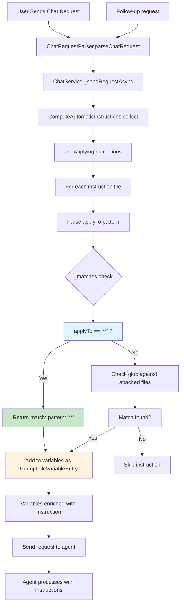

# Understanding Copilot VS Code Custom Instructions Injection

Based on the VS Code GitHub Copilot Chat codebase, I'll explain the mechanism and timing of custom instruction injection, focusing on pattern-matching via `applyTo`, and then provide a visualization to build your understanding. This will help inform your work on a custom AI Agentic System using Microsoft Agent Framework in .NET.

## Key Mechanism: Pattern-Matching via `applyTo`

Custom instructions are defined in `.prompt.md` files with frontmatter like:

```markdown
---
description: My instruction
applyTo: "**"
---
Instruction content here.
```

The `applyTo` field uses glob patterns to determine when an instruction should be automatically injected as a variable into the chat request.

### How `applyTo: "**"` Works

1. **Pattern Recognition**: In `computeAutomaticInstructions.ts`, the `_matches()` method treats `"**"` as a special wildcard:

```typescript
if (pattern === '**' || pattern === '**/*' || pattern === '*') {
    // if glob pattern is one of the special wildcard values,
    // add the instructions file event if no files are attached
    return { pattern };
}
```

This returns a match **regardless of attached files**.

1. **Injection Logic**: In `addApplyingInstructions()`, for each instruction file:
   - Parse the `applyTo` pattern
   - Call `_matches()` against the request's context (attached files/variables)
   - If `applyTo: "**"` → always matches
   - Add the instruction as a `PromptFileVariableEntry` to the request variables

2. **Variable Format**: Instructions are injected as variables (e.g., `{ kind: 'instruction', value: uri, reason: '...', auto: true }`), not direct system prompts.

## Timing and Frequency

**When it's injected**: During every request processing in `chatServiceImpl.ts::_sendRequestAsync()`:
1. Parse the chat request
2. Call `ComputeAutomaticInstructions.collect()` to gather instructions
3. Add matched instructions to request variables
4. Send the enriched request to the agent

**For follow-up requests**: The `collect()` method runs fresh for **every request** (initial and follow-ups). Since `applyTo: "**"` always matches, the instruction is injected **for every follow-up request** as well.

## Relation to Chat Request Context

The "chat request context" is the set of attached files, tools, and previously processed instructions. Pattern-matching checks if an instruction's `applyTo` glob matches any files in this context. For `"**"`, it bypasses this check and always matches.

## Visualization



This flow repeats for every request, ensuring `applyTo: "**"` instructions are always included.

## Implications for Your .NET Agentic System

When building a custom AI Agentic System with Microsoft Agent Framework:
- Implement similar variable injection logic where instructions are added as request metadata
- Use glob pattern matching for contextual instruction selection
- Ensure instruction collection happens per-request to maintain freshness
- Consider caching parsed instructions but refresh on context changes

This pattern allows flexible, context-aware instruction delivery without modifying the core message format, which you can adapt to .NET's agent framework architecture.
