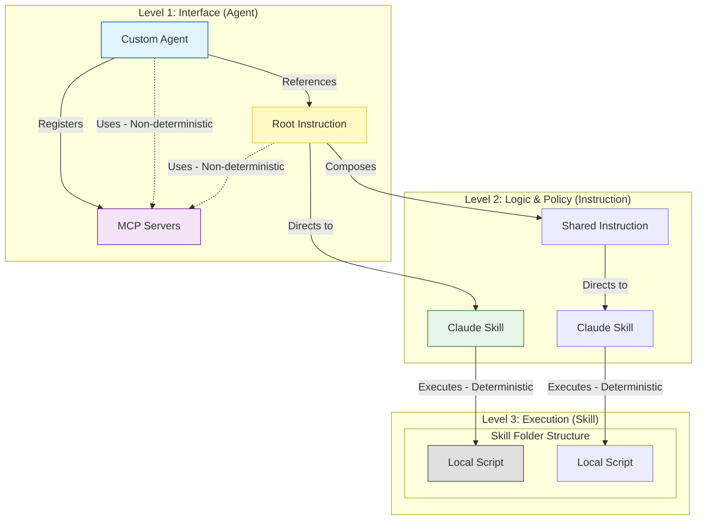
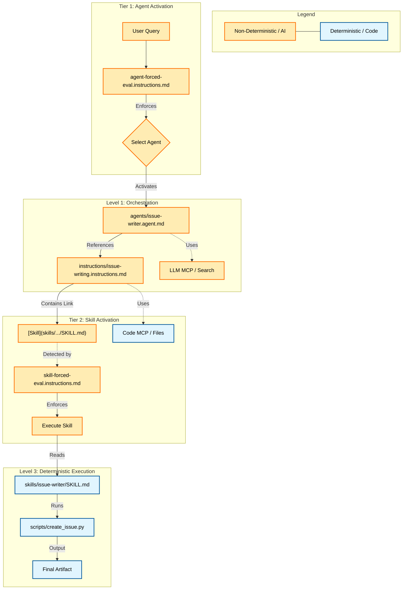

# ADR: Agent -> Instruction -> Skill Architectural Pattern

## Context

We are currently using "Monolithic Agents" where all logic, persona, and workflow definitions reside in a single `.agent.md` file. This leads to:
- **Duplication**: Common workflows (like "Git Commit Standards") are repeated across agents.
- **Context Limits**: Large agent definitions consume context window even when parts aren't needed.
- **Maintenance Overhead**: Updating a shared process requires editing multiple agent files.

## Decision

We will adopt a **Composed Architecture** pattern that strictly separates concerns into three hierarchical levels, with specific rules for tooling and determinism:

### Level 1: Custom Agent (`*.agent.md`)

- **Role**: The **Orchestrator** & **Interface**.
- **Responsibility**: Defines the Persona, Mission, and workflow orchestration. Registers **MCP Servers**.
- **Tooling**: Registers MCP tools; directly uses them for steering and discovery.
- **Dependency**: `Agent -> Instruction`.
- **Orchestration**: The Agent is responsible for coordinating multiple Instructions and Skills. Multi-Skill workflows are orchestrated at the Agent level, not delegated to Instructions.

### Level 2: Custom Instruction (`*.instructions.md`)

- **Role**: The **Policy Maker**.
- **Responsibility**: Defines workflow steps, decision logic, and constraints.
- **Tooling**: Can reference MCP tools for intermediate steps and directs Skills for execution.
- **Dependency**: `Instruction -> Skill` or `Instruction -> Instruction`.
- **⚠️ Best Practice**: Avoid circular references (A → B → A). VS Code's context resolution handles cycles gracefully, but circular dependencies make reasoning harder and should be documented.

### Level 3: Claude Skill (`skills/*/SKILL.md`)

- **Role**: The **Executor**.
- **Responsibility**: Defines the Mechanism for deterministic execution.
- **Tooling**: Tightly coupled **Scripts** (Python/PowerShell) located in `scripts/` subfolder.
- **Nature**: "Hard" skills with predictable outputs.
- **Standard Structure**: Follow the [Skill Creator Skill](skills/skill-creator/SKILL.md) for canonical skill layout, metadata, and initialization.

## Tooling & Determinism Boundary

### Core Principle

**Determinism is fundamentally driven by implementation type, not tooling category:**

- **Deterministic (Code-Based Output)**: Scripts and code-based MCP Servers produce reproducible, verifiable results. Same input → Same output, always.
- **Non-Deterministic (LLM-Based Output)**: Any invocation of an LLM (direct or via MCP wrapper) produces variable results. Same input → Different output, contextually.

### Deterministic Layer (Code-Based)

- **Scripts**:
  - Tightly coupled to a specific Skill.
  - Located in `skills/<skill-name>/scripts/` (Python/PowerShell).
  - Pure transformations: "Calculate Tax", "Generate PDF", "Parse XML", "Format JSON".
  - Input → Output is always consistent and verifiable.

- **Code-Based MCP Servers**:
  - Registered at the Agent level.
  - Provide deterministic APIs: database queries, file operations, system introspection.
  - Output is reproducible and auditable.

### Non-Deterministic Layer (LLM-Based)

- **LLM-Based MCP Servers**:
  - Wrappers around external LLM services (e.g., Claude API, GPT, web search + summarization).
  - Output varies based on temperature, context, model state.
  - Used for discovery, synthesis, creative tasks (e.g., "Search and summarize", "Generate documentation").

- **Direct LLM Invocation** (inside Agents/Instructions):
  - Any freeform reasoning or generation.
  - Output is variable and context-dependent.
  - High flexibility, high variance.

### Reducing Non-Determinism: Review & Validation Workflows

Non-deterministic outputs can be made more deterministic (to a degree) through **structured review processes**:

1. **Inline Review**: Agent generates output → User reviews and approves → Committed only if valid.
2. **Validation Gates**: LLM output → Automated validator (code-based script) → Pass/Fail decision.
3. **Deterministic Refinement**: LLM output → Code script reformats/normalizes → Deterministic output.

**Example**: 
- Issue-Writer Skill uses an LLM to generate issue content, but a code-based script validates metadata (title, date, tags) and formats the final output. This reduces output variance.

### Two Principal Strategies to Increase Determinism

The architecture recognizes two core levers for moving toward deterministic execution:

1. **Distill Logic to Code Execution**:
   - Convert LLM-based reasoning into code-based transformations.
   - Push core logic down from Agents/Instructions into Scripts.
   - Example: Instead of "Let the LLM decide the commit message structure", write a script that formats commit messages deterministically.

2. **Design Strategic Workflows with Review/Validation/Testing**:
   - Accept non-deterministic LLM output as input to a larger workflow.
   - Introduce validation gates and review processes between LLM output and final commit.
   - Example: LLM generates issue → Validator checks metadata → Formatter normalizes → Human reviews → Committed.

**Both strategies can be combined**: Identify deterministic parts and extract them to code; keep creative/discovery parts as LLM-based with validation gates.

### Decision Framework

| Scenario                                  | Tool              | Determinism               | Rationale                        |
| ----------------------------------------- | ----------------- | ------------------------- | -------------------------------- |
| Calculate tax, format JSON, parse XML     | Script            | ✅ Deterministic           | Code-based transformation        |
| Query database, list files                | Code MCP          | ✅ Deterministic           | Code-based API                   |
| Generate documentation, summarize content | LLM MCP           | ❌ Non-Deterministic       | LLM-based output                 |
| Orchestrate multi-step discovery          | Agent + LLM       | ❌ Non-Deterministic       | Free-form reasoning              |
| Generate + Validate + Format              | LLM + Code Script | ⚠️ Reduced Non-Determinism | Hybrid workflow with review gate |

### Objective

**Maximize deterministic pathways; minimize non-deterministic layers; use review workflows to bridge the gap where LLM-based output is necessary.**

## Visual Model



## Concrete Implementation Diagram

This diagram illustrates the **Enforcement Hooks** (`agent-forced-eval` and `skill-forced-eval`) that drive the architecture in practice.



## Implementation Strategy

Since VS Code Copilot does not have a native `#include` directive, we use **Semantic Linking**.

**Syntax:**
Use standard Markdown links with directive verbs to reference context. VS Code proactively loads all custom instructions files linked in this manner into the system context of a chat request, promoting reuse.

1. **Agent → Instruction**:
    > "Follow the workflow defined in [Issue Writing Instructions](instructions/issue-writing.instructions.md)."

2. **Instruction → Skill**:
    > "To generate the file, execute the [Issue Writer Skill](skills/issue-writer/SKILL.md)."

## Example Refactor: Issue-Writer

**Before**: All logic in `agents/issue-writer.agent.md`.

**After**:

1. **The Agent** (`agents/issue-writer.agent.md`):

    ```markdown
    # Issue Writer Agent
    You are the **Issue Writer**.
    ## Mission
    Analyze requests and create documentation.
    ## Instructions
    Strictly follow: [Issue Writing Instructions](instructions/issue-writing.instructions.md)
    ```

2. **The Instruction** (`instructions/issue-writing.instructions.md`):

    ```markdown
    # Issue Writing Workflow
    ## Metadata Standard
    (Logic moved here...)
    ## Execution
    Use: [Issue Writer Skill](skills/issue-writer/SKILL.md)
    ```

3. **The Skill** (`skills/issue-writer/SKILL.md`):
    *(Remains unchanged, containing the `create_issue.py` script usage)*

## Consequences

**Positive:**
- **Separation of Concerns**: Clear boundaries between "Who" (Agent), "How" (Instruction), and "What" (Skill).
- **DRY (Don't Repeat Yourself)**: Instructions like "Git Standards" can be written once and referenced by multiple agents.
- **Scalability**: Easier to manage small, focused files than massive prompts.
- **Determinism**: Pushing execution logic down to Skills (and scripts) increases reliability and testability.
- **Flexibility**: Agents can be composed from reusable instructions and skills.

**Negative:**
- **Complexity**: Requires managing dependencies across multiple files.
- **Navigation**: The Agent (and developer) must follow links to understand the full behavior.
- **Semantic Linking Limitations**: Markdown links lack built-in validation; missing or broken references are discovered only at runtime.

## Future Work & TODOs

- **Link Validation** (TODO): Create a linter script to validate that all referenced `.instructions.md` and `SKILL.md` files exist (mitigates runtime errors).
- **Circular Dependency Detection** (TODO): Implement graph analysis in the build/test phase to detect and prevent circular references between instructions.
- **Testing Strategy** (TODO): Define how to test composed instructions and multi-skill workflows. Explicitly distinguish between **Unit Tests** (100% coverage for deterministic Skills/Scripts) and **Evals/Integration Tests** (for Instructions/Agents).
- **Migration Path** (TODO): Document step-by-step refactoring of existing monolithic agents into the composed architecture.
- **Versioning & Breaking Changes** (Deferred): Design a versioning scheme for skills to manage backward compatibility and breaking changes.
