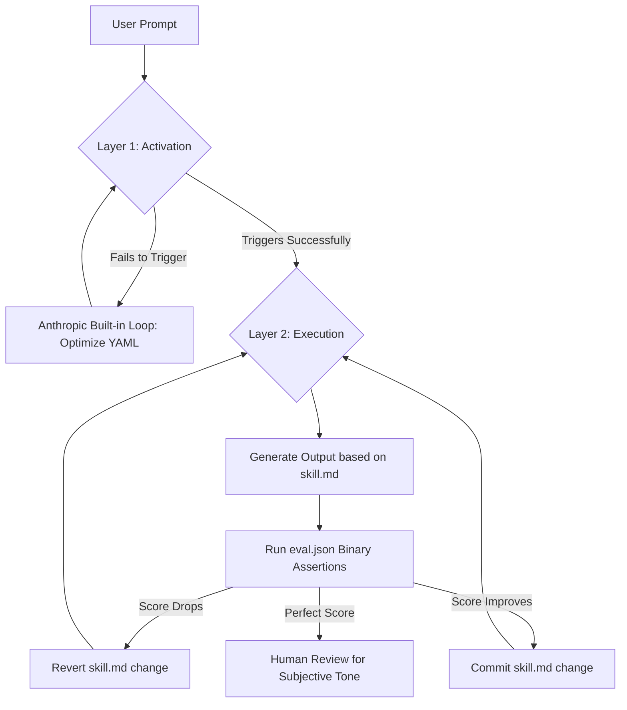

# RFC: AI Skill Self-Improvement Framework (Autonomous Skill Optimization Loop)

## Summary

Introduce a dual-loop autonomous feedback system that lets Claude Code self-optimize its own skills overnight — without human prompt-engineering intervention. Loop 1 targets **activation accuracy** (YAML description tuning); Loop 2 targets **output quality** (skill.md rule refinement via binary assertions and hill-climbing). Together they form a "Dual-Orbit Agent Loop" that continuously improves both when a skill fires and what it produces.

## Motivation

Manual prompt engineering is a slow, subjective, trial-and-error process. Developers spend weeks tweaking a single `skill.md` file based on gut feel. The core assumption ("quality is subjective") is only partially true — structural and formatting criteria are entirely objective and verifiable. By isolating binary-testable criteria and feeding them into an autonomous loop, we can reach a state where skills evolve and improve while the developer is offline.

The strategic shift: move human effort from *writing prompts* to *writing strict, objective tests*.

## Detailed Design

### Two Layers of a Claude Skill

| Layer | File | Governs | Who Optimizes |
|---|---|---|---|
| **Layer 1 – Activation** | `skill.yaml` description field | Whether the skill triggers on the right prompt | Anthropic's built-in skill creator loop |
| **Layer 2 – Execution** | `skill.md` + context files | Whether the output follows the defined rules | Custom Karpathy-style hill-climbing loop |

### Components

- **`skill.md`** — Instructions and constraints for the AI output
- **`evals/eval.json`** — Test cases and ~25 binary assertions (True/False structural checks)
- **Context files** — Reference materials (e.g., `tone_of_voice.md`, `brand_guidelines.md`)
- **Execution script** — Orchestrates the hill-climbing loop

### Feedback Loop 1 — Activation (Built-in Anthropic Layer)

Runs test queries → measures trigger accuracy → proposes new YAML description → loops until activation rate reaches target.

### Feedback Loop 2 — Execution (Custom Karpathy Layer)

```
Read skill.md → Make one rule change → Run eval.json tests
  → If score improves: git commit change
  → If score drops:    git reset, try different change
  → Loop indefinitely until perfect score or manual stop
```

### Setting Up the Loop (Playbook)

1. **Draft baseline `skill.md`** and provide reference context files
2. **Generate `evals/eval.json`** — ask Claude Code to write ~25 binary assertions based on desired output
3. **Assertions must be binary**: "Word count < 300" ✓ | "Is it engaging?" ✗ — Remove all subjective metrics
4. **Run the loop**: instruct Claude to apply hill-climbing against the score (commit if improved, revert if worse)
5. **Human review pass**: use qualitative dashboard for tone/creativity checks the binary loop cannot catch

### Binary Assertion Template (Examples)

| Assertion | Type |
|---|---|
| Word count < 300 | Structural |
| First paragraph is a single sentence | Structural |
| No M-dashes present | Formatting |
| Output begins with an action verb | Style |
| No sentence exceeds 20 words | Readability |

### Dual-Loop System Diagram



## Alternatives Considered

- **Manual prompt tuning**: Slow, non-repeatable, limited by human availability. Does not scale.
- **LLM-as-a-judge evaluation**: Enables qualitative scoring but reintroduces subjectivity and cost. Best used as a supplementary human-in-the-loop pass, not as the primary optimization signal.
- **Purely qualitative dashboards (Anthropic skill creator)**: Handles Layer 1 well but has no mechanism for autonomous Layer 2 optimization.

## Reusable Artifacts

1. **Assertion Playbook** — Template library for converting subjective desires into binary assertions (e.g., "Make it punchy" → "No sentences over 15 words" + "First paragraph must be one line")
2. **Dual-Loop System Diagram** — Mermaid.js architecture diagram (see above)
3. **Continuous Eval Log** — Persistent document tracking cases where a perfectly-scored output was rejected by a human; each entry is a candidate for a new binary assertion

## Unresolved Questions

- [ ] How do we prevent the loop from "gaming" assertions — producing structurally perfect but logically incoherent output? (Candidate resolution: add intermediate LLM-as-a-judge evaluations for semantic coherence)
- [ ] What is the optimal number of binary assertions before the skill becomes over-constrained and fails entirely?
- [ ] How do we handle assertion conflicts — where satisfying one assertion makes another impossible to satisfy?
- [ ] Should the loop target 100% pass rate or a threshold (e.g., 23/25) to leave room for edge-case flexibility?

## References

- Source analysis: *"Build Self-Improving Claude Code Skills"* — Simon Scrapes
- Pattern: Andrej Karpathy's Auto-Research hill-climbing loop (applied to prompt engineering)
- Pattern: Test-Driven Development — write the tests before writing the code (here: write `eval.json` before refining `skill.md`)
