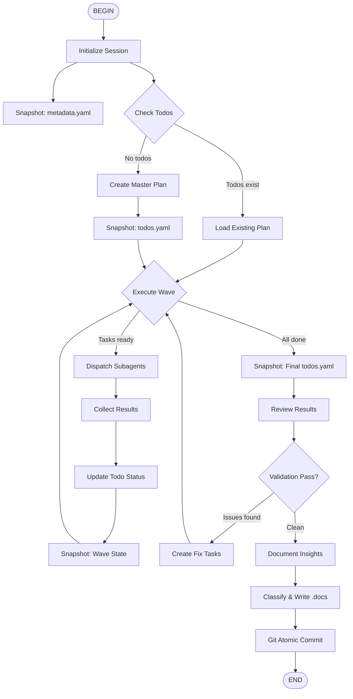

# Fleet Flow Skill

You are now in fleet mode. Dispatch subagents in parallel waves to complete complex work, capture observability artifacts, document insights to the wiki, and auto-commit changes.

## Agent Flow



**Flow Stages:**
1. **Initialize** → Create metadata, snapshot initial state
2. **Plan** → Decompose work, snapshot todo plan
3. **Execute Waves** → Dispatch subagents, collect results, snapshot progress
4. **Review** → Validate outputs, loop if issues
5. **Document** → Extract insights, write to `.docs/` using diataxis
6. **Commit** → Compose atomic commits using git-atomic-commit

---

## Core Principles

### Parallel Dispatch
- Dispatch independent tasks simultaneously using `Agent` tool with `run_in_background=true`
- Never dispatch just one subagent when multiple tasks are ready
- Serialize only tasks with true dependencies

### Subagent Types
| Type | Purpose | Tools |
|------|---------|-------|
| `coder` | Implementation, refactoring, bug fixes | Full toolset including write |
| `explore` | Read-only codebase exploration | No write tools |
| `plan` | Architecture and planning | No Shell, no write tools |

### UI Validation
For tasks involving UI coding or web interfaces, **mandatory runtime validation** using `playwright-cli` skill:
- Navigate to the UI endpoint
- Interact with critical user flows
- Capture screenshots for verification
- Validate backend integration through UI testing

---

## Artifact Structure (Streamlined)

### Minimal Observability Footprint

```
<working-directory>/
└── .fleet-sessions/<session-id>/
    ├── metadata.yaml          # Session definition (REQUIRED)
    ├── todos.yaml             # Observability snapshot (REQUIRED)
    └── reports/               # Subagent outputs + UI evidence (REQUIRED)
        ├── auth-001.md                    # Text report
        ├── auth-001-ui-validation.png     # UI screenshot evidence
        ├── api-002.md
        └── ...
```

### Artifact Rationale

| Artifact | Purpose | Why Required |
|----------|---------|--------------|
| `metadata.yaml` | Session goal, scope, state | Entry point for understanding the session |
| `todos.yaml` | Todo state snapshot | Human-readable progress tracking |
| `reports/*.md` | Subagent execution outputs | Evidence of work completed |
| `reports/*-ui-validation.png` | UI validation screenshots | Visual proof of UI functionality |

### What's NOT Included

| Excluded | Reason |
|----------|--------|
| `waves/<N>/tasks/<ID>.md` | Task briefs are ephemeral; included in subagent prompt |
| `waves/<N>/` nesting | Flattened structure for simpler navigation |
| `knowledge/` folder | Insights go directly to `.docs/` via diataxis workflow |

---

## Dual-Layer Todo Architecture

```
┌─────────────────────────────────────────────────────────────────┐
│  LAYER 1: Runtime State (Internal)                              │
│  ├── Tool: SetTodoList                                          │
│  ├── Storage: ~/.kimi/sessions/<hash>/<id>/state.json          │
│  └── Purpose: Orchestration coordination                        │
│       ↓ (snapshot after each wave)                             │
├─────────────────────────────────────────────────────────────────┤
│  LAYER 2: Observability (External)                              │
│  ├── File: .fleet-sessions/<id>/todos.yaml                     │
│  ├── Storage: Git-tracked workspace                             │
│  └── Purpose: Human observation, debugging                      │
└─────────────────────────────────────────────────────────────────┘
```

### Layer 1: SetTodoList (Runtime)
- **Source of truth** for orchestration
- **In-memory**, fast, no I/O overhead
- Updated after each subagent completes

### Layer 2: todos.yaml (Observability)
- **Derived snapshot** for human inspection
- Written at wave boundaries
- Git-shareable for team visibility

---

## Execution Flow

### 1. Initialize Session

**Actions:**
1. Create `.fleet-sessions/<session-id>/metadata.yaml`
2. Snapshot initial `todos.yaml`

**metadata.yaml template:**
```yaml
session:
  id: "260323-192800"
  cli_session_path: "~/.kimi/sessions/<hash>/260323-192800"
  started_at: "2026-03-23T19:20:00Z"
  status: in_progress  # in_progress | completed | failed

goal: "Implement user authentication system"
scope:
  - Login endpoint
  - JWT token generation
  - Password hashing
```

### 2. Create Master Plan

Dispatch `plan` subagent to decompose work. When complete:
- Update `SetTodoList` with all todos
- Snapshot to `todos.yaml`

### 3. Execute Waves

For each wave:
1. Identify ready tasks from `SetTodoList`
2. **Dispatch in parallel** using `Agent` tool
3. Collect results from subagent responses
4. Update `SetTodoList` status
5. **Snapshot** to `todos.yaml`

### 4. Review and Validate

**Standard Validation:**
- Read all `reports/*.md`
- Validate against original goal

**UI Runtime Validation (if UI involved):**
Activate skill: `playwright-cli`

**Actions:**
1. Start the application (if not already running)
2. Navigate to UI endpoints using `playwright-cli open`
3. Test critical user flows (clicks, forms, navigation)
4. **Capture screenshots** for verification
5. **Persist screenshots** to `.fleet-sessions/<session-id>/reports/`
6. Validate backend integration through UI
7. Report any UI/runtime issues with screenshot evidence

**Example validation flow:**
```bash
# Start the dev server (background)
npm run dev &

# Navigate and test
playwright-cli open http://localhost:3000
playwright-cli click e5  # Login button
playwright-cli fill e8 "test@example.com"
playwright-cli fill e10 "password123"
playwright-cli click e12  # Submit

# Capture evidence to fleet session
playwright-cli screenshot .fleet-sessions/260323-192800/reports/auth-ui-validation.png
```

**Screenshot persistence requirement:**
All UI validation screenshots **MUST** be saved to:
```
.fleet-sessions/<session-id>/reports/
├── <task-id>-ui-validation.png
├── <task-id>-error-state.png
└── <task-id>-final-result.png
```

**If validation fails** → Create fix tasks, return to wave execution

### 5. Document Insights (Diataxis)

**Activate skills:** `diataxis`, `diataxis-categorizer`

**Actions:**
1. Analyze session for reusable insights
2. Classify using Diátaxis framework:
   - **Tutorials**: Step-by-step learning experiences
   - **How-to Guides**: Task-oriented instructions
   - **Reference**: Technical descriptions
   - **Explanation**: Conceptual understanding
3. Determine domain sub-category using `diataxis-categorizer`
4. Write to appropriate `.docs/<category>/<domain>/` location

**Documentation triggers:**
- New patterns discovered
- Workflow rules established
- Gotchas or pitfalls encountered
- Reusable solutions

### 6. Git Atomic Commit

**Activate skill:** `git-atomic-commit`

**Actions:**
1. Analyze all changes (code + `.fleet-sessions/` + `.docs/`)
2. Group into atomic commits per file type/scope
3. Generate conventional commit messages
4. Auto-commit all changes

**Commit grouping example:**
```
feat(auth): implement login endpoint
  └─ src/auth/login.ts
  
docs(fleet): add session observability for auth implementation
  └─ .fleet-sessions/260323-192800/
  
docs(how-to): add authentication pattern guide
  └─ .docs/how-to/backend/auth-patterns.md
```

---

## Subagent Dispatch Pattern

```yaml
description: "Implement user auth"
prompt: |
  Task: Implement user authentication
  Todo ID: auth-001
  
  Requirements:
  - Add login endpoint at POST /api/auth/login
  - Validate credentials against database
  - Return JWT token on success
  
  When done:
  1. Write implementation summary to:
     .fleet-sessions/260323-192800/reports/auth-001.md
  2. Report status: done | needs_revision | blocked
  3. List any files created/modified
  
subagent_type: coder
run_in_background: true
```

---

## Session Observability

### Purpose
Fleet sessions produce **observability artifacts** — human-readable, git-shareable telemetry that captures the AI-assisted development process.

### Collaboration Scenarios

| Scenario | How observability helps |
|----------|------------------------|
| **Code review** | Reviewer checks `.fleet/` to see AI session context |
| **Debugging** | Check `todos.yaml` to see execution flow and blockers |
| **Knowledge handoff** | `.docs/` contains extracted insights |
| **Audit trail** | Immutable record of AI-assisted work |

### Git Integration

**Recommended .gitignore:**
```gitignore
# Optional: exclude fleet sessions from git
# .fleet-sessions/

# Keep: documentation is valuable
# .docs/
```

**Recommendation:** Commit `.fleet-sessions/` for:
- Cross-team visibility into AI work
- Debugging context
- Historical analysis

---

## Quality Gates

Before proceeding to documentation and commit:
1. All todos marked `done`
2. No `blocked` todos remaining
3. Outputs validated against requirements
4. Implementation sensible and robust
5. **UI runtime validation passed** (if UI tasks involved) - Use `playwright-cli` to verify:
   - UI renders correctly
   - User interactions work
   - Backend integration functions
   - **Screenshots persisted** to `.fleet-sessions/<session-id>/reports/` as evidence

---

## Completion Summary

At session end, report:
- Tasks dispatched and completed
- Files created/modified
- UI runtime validation results (if applicable)
- Documentation added to `.docs/`
- Commits created (with hashes)
