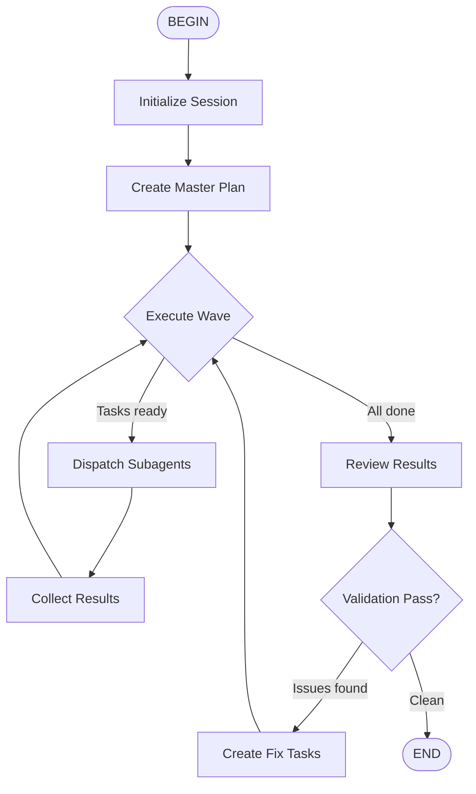

# Fleet Flow Skill

Dispatch subagents in parallel waves to complete complex work.

## Agent Flow

## Core Principles

- Dispatch independent tasks simultaneously using `Agent` tool with `run_in_background=true`
- Use `coder`, `explore`, or `plan` subagent types appropriately
