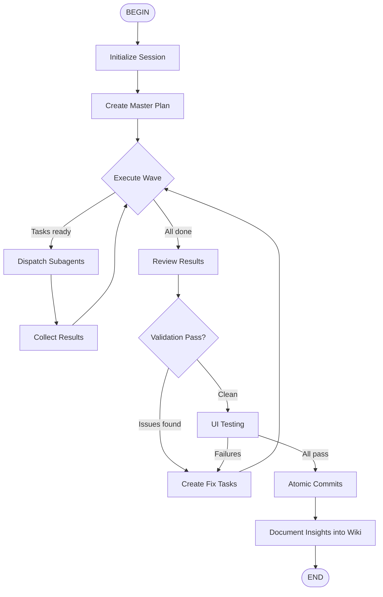

# Fleet Flow Skill

Dispatch subagents in parallel waves to complete complex work.

## Agent Flow



## Core Principles

- Dispatch independent tasks simultaneously using `Agent` tool with `run_in_background=true`
- Use `coder`, `explore`, or `plan` subagent types appropriately

## Step: UI_TEST — UI Testing

**Trigger:** After `VALIDATE` passes with no remaining issues **and** the task has a visual/browser-facing component. Skip this step for pure back-end or CLI tasks.

Apply the `playwright-cli` skill to exercise the UI exactly as a real human user would.

### Resolve screenshot directory

All screenshots are persisted into the current Kimi Code session folder:

```
~/.kimi/sessions/<workspace-hash>/<current-session-id>/.fleet/screenshots/
```

Resolve the path at runtime before taking any screenshots:

```bash
# Kimi Code exposes the session root via environment variable
SCREENSHOT_DIR="${KIMI_SESSION_DIR}/.fleet/screenshots"
mkdir -p "$SCREENSHOT_DIR"
```

If `KIMI_SESSION_DIR` is unavailable, derive it manually:

```bash
# Find the most-recently modified session directory
SESSION_ROOT=~/.kimi/sessions
SCREENSHOT_DIR=$(ls -dt "$SESSION_ROOT"/**/* 2>/dev/null | head -1)/.fleet/screenshots
mkdir -p "$SCREENSHOT_DIR"
```

### Screenshot naming convention

```
<step-number>-<action-slug>-<YYYYMMDDTHHmmss>.png
```

Examples: `01-initial-load-20260402T143000.png`, `03-submit-form-20260402T143015.png`

### Process

1. **Open the app** — navigate to the local dev URL (e.g. `http://localhost:3000`).
2. **Baseline screenshot** — capture the initial state as evidence.
   ```bash
   playwright-cli open http://localhost:3000
   playwright-cli screenshot
   # Then move/copy to screenshot dir with proper name
   ```
3. **Walk critical user journeys** — exercise each major flow identified during PLAN:
   - Use `snapshot` to read element refs, then `click` / `fill` / `select` to interact.
   - Simulate real user pacing: take a `snapshot` before and after each significant action.
   - Take a **named screenshot** after every meaningful state change:
     ```bash
     playwright-cli screenshot
     cp screenshot.png "$SCREENSHOT_DIR/02-after-login-$(date +%Y%m%dT%H%M%S).png"
     ```
4. **Check for errors** — after each journey, inspect console and network:
   ```bash
   playwright-cli console
   playwright-cli network
   ```
5. **Assert visually** — use `eval` to read DOM state and confirm expected values are rendered:
   ```bash
   playwright-cli eval "document.querySelector('h1').textContent"
   ```
6. **Capture failure evidence** — if anything looks wrong, take a screenshot immediately before creating a FIX task, so the failure is documented.

### Pass / Fail criteria

| Result | Condition | Next step |
|--------|-----------|----------|
| **All pass** | No console errors, all assertions green, screenshots show expected UI | → COMMIT |
| **Failures found** | Console errors, unexpected UI state, broken interactions | Create FIX tasks → loop back to WAVE |

### Screenshots as commit evidence

Screenshots saved under `.fleet/screenshots/` are **not committed to git**. They remain in the Kimi session folder as ephemeral evidence for the current run. The DOCUMENT step may reference their filenames in the explanation wiki page.

---

## Step: COMMIT — Atomic Commits

**Trigger:** After `VALIDATE` passes with no remaining issues.

Apply the `git-atomic-commit` skill (with `git-commit-scope-constitution` as its companion):

1. **Ensure constitution exists** — check for `.github/git-scope-constitution.md`.
   - If absent, run `git-commit-scope-constitution` to generate it from the repository structure and git history before proceeding.
2. **Analyze all changes** — run `git status --short` and diff each changed file.
3. **Assign type + scope per file** — use the Tier 1/2/3 hierarchy from `git-atomic-commit`. Every file gets a `type(scope)` label before any grouping begins.
4. **Run the pre-commit verification checklist** (type mapping, scope selection, no generic types, atomic grouping, dependency order).
5. **Group into atomic commits** — files sharing the same type and related scope form one commit. Different types → separate commits.
6. **Generate conventional commit messages** — `type(scope): subject` + optional body.
7. **Execute commits in dependency order** — stage files for each commit and commit sequentially.
8. **Report** — list all commits created with their messages.

**Autonomous mode:** Execute all commits automatically without user prompts; surface a summary when done.

## Step: DOCUMENT — Document Insights into Wiki

**Trigger:** After `COMMIT` completes successfully.

Apply the `diataxis` + `diataxis-categorizer` skills to capture what was learned:

### What to document

Capture content that would benefit future iterations or agents:

| Source | Target Diátaxis category | Examples |
|--------|--------------------------|---------|
| Reusable procedures discovered during the task | **How-to guide** | "How to configure X", "How to run Y pipeline" |
| Technical facts, APIs, config options | **Reference** | Data model schemas, CLI flag lists |
| Conceptual understanding gained | **Explanation** | Why the architecture is structured this way |
| Step-by-step learning journeys | **Tutorial** | First-time setup walkthrough |

Lessons learned and gotchas **always** go into an **Explanation** page (or appended to an existing one).

### Where to write

Use the `.docs/` structure:

```
.docs/
├── tutorials/          # Learning-oriented lessons
├── how-to/             # Task-oriented guides
├── reference/          # Technical descriptions
└── explanation/        # Conceptual discussions + lessons learned
```

Apply the `diataxis-categorizer` three-rule heuristic to determine the correct sub-folder:
1. **Keyword extraction** — identify the primary domain from filename → frontmatter → H1 → body scan.
2. **Reuse check** — if a matching `<category>/<domain>/` folder exists, place the file there.
3. **Create check** — if ≥3 peers share the domain and no sub-folder exists, create it and move peers.
4. **Fallback** — store at the category root if no domain dominates.

### Process

1. Collect key insights from REVIEW and COMMIT outputs (what worked, what failed, surprises, reusable patterns).
2. For each insight, determine its Diátaxis category (How-to / Reference / Explanation / Tutorial).
3. Apply `diataxis-categorizer` to find or create the correct sub-folder path.
4. Write or append to the target `.md` file using the appropriate template from the `diataxis` skill.
5. Run `python skills/diataxis/scripts/generate_index.py` (if available) to refresh `.docs/index.md`.
6. Stage and commit documentation changes as a separate `docs(...)` commit (do **not** mix with code commits from the COMMIT step).
