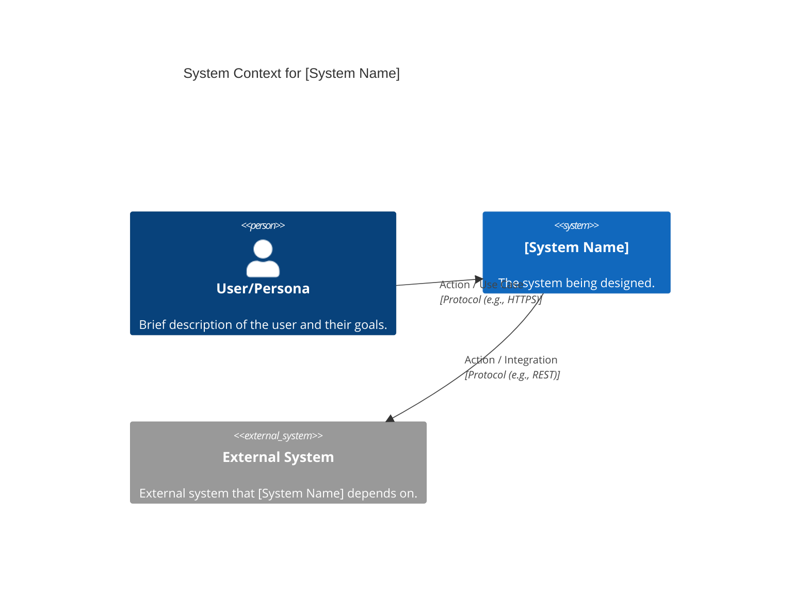
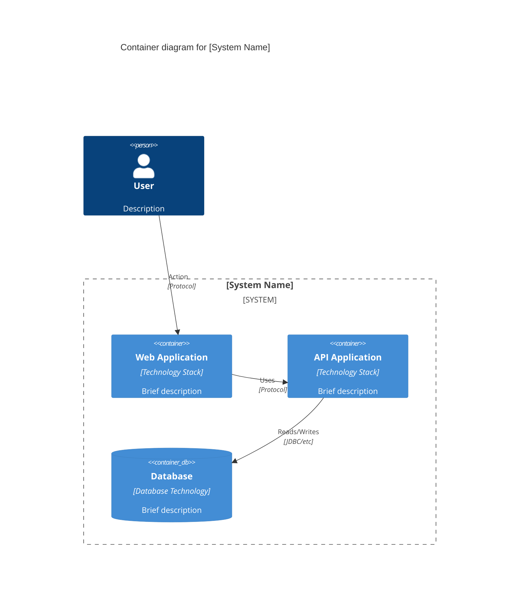
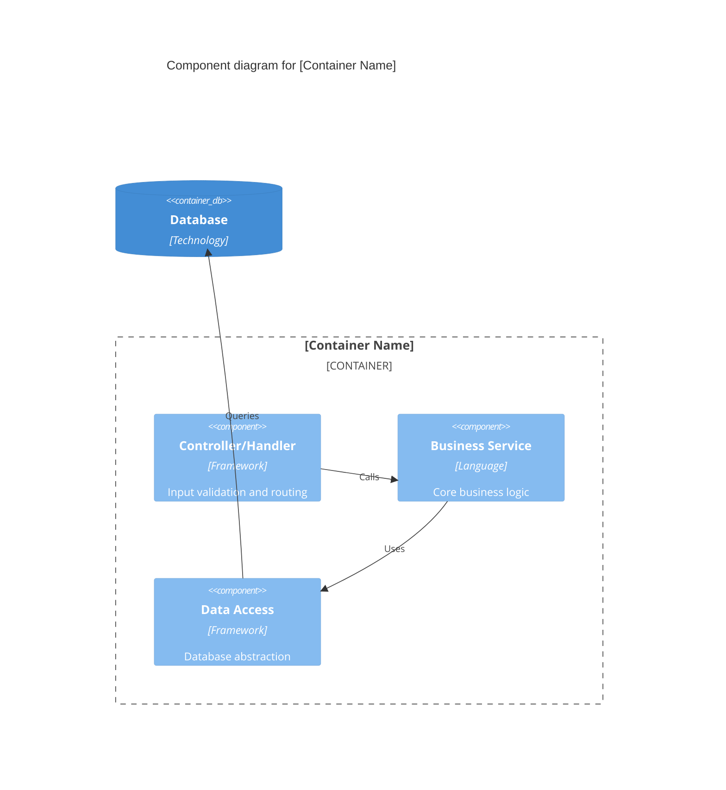
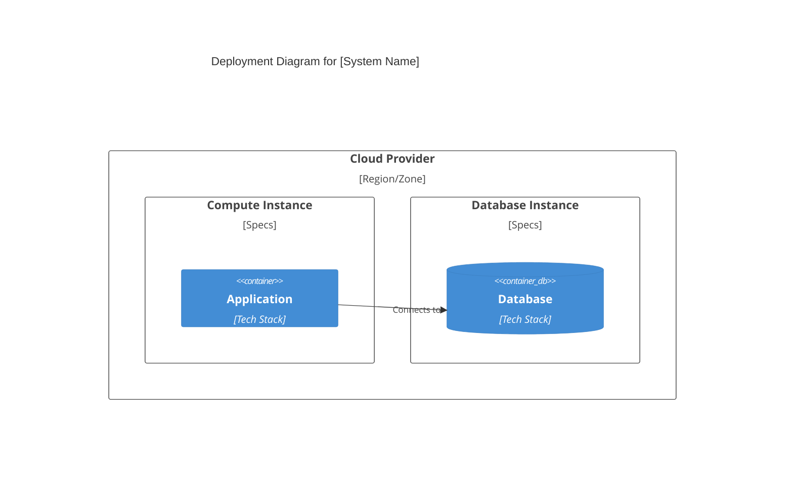

# C4 Model Architecture Template

This template provides a structured approach to documenting a system's architecture using the C4 model.

## 1. System Context (Level 1)

**Purpose:** Document the system in its environment, showing users and external dependencies.

## 2. Containers (Level 2)

**Purpose:** Show the high-level technical building blocks (apps, databases, services).

## 3. Components (Level 3)

**Purpose:** Zoom into a specific container to show its internal structure.

## 4. Deployment (Optional)

**Purpose:** Map containers to infrastructure.

## 5. Summary Table

| Level         | Audience                          | Focus                                |
| ------------- | --------------------------------- | ------------------------------------ |
| 1. Context    | Stakeholders, Business, Technical | External dependencies and users      |
| 2. Container  | Architects, Technical Leads       | Services, apps, and data stores      |
| 3. Component  | Developers                        | Internal modules and interactions    |
| 4. Deployment | DevOps, SRE                       | Infrastructure and hosting resources |
