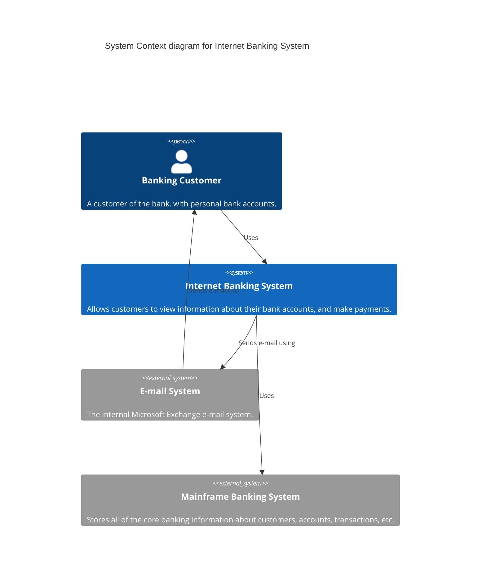
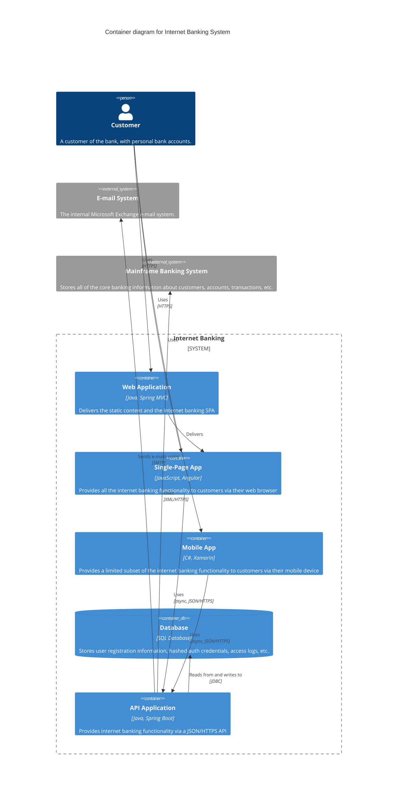
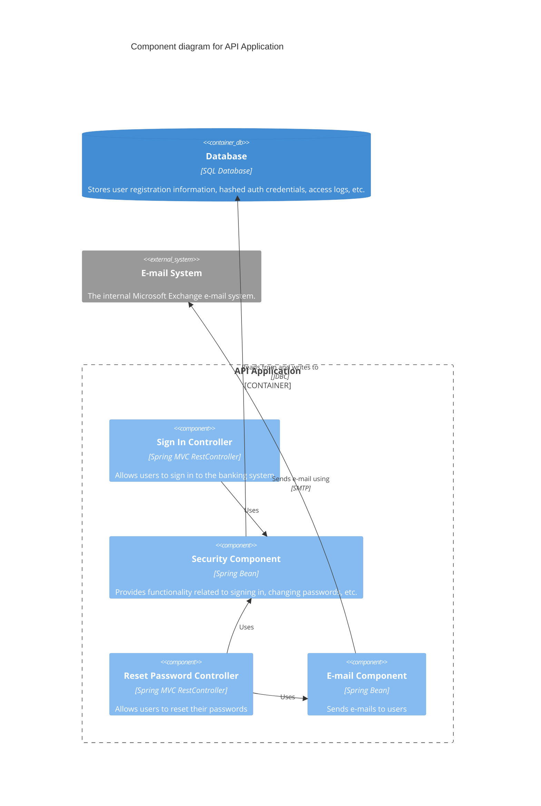
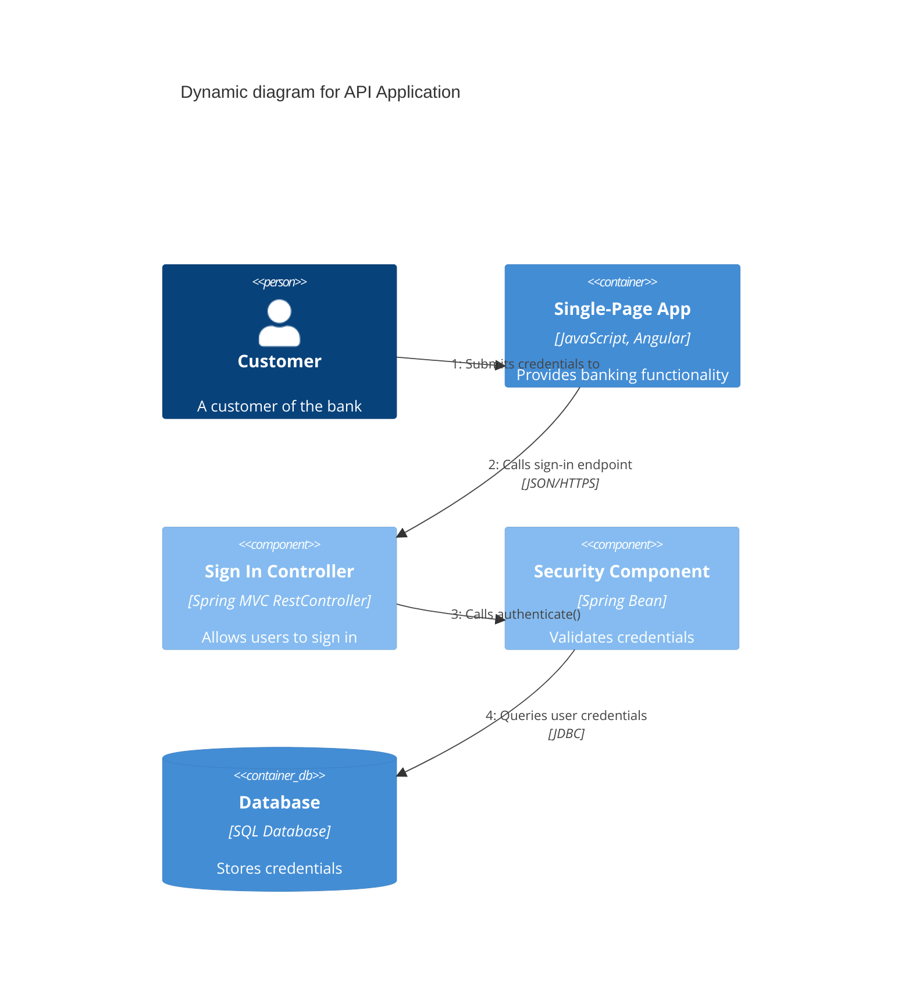
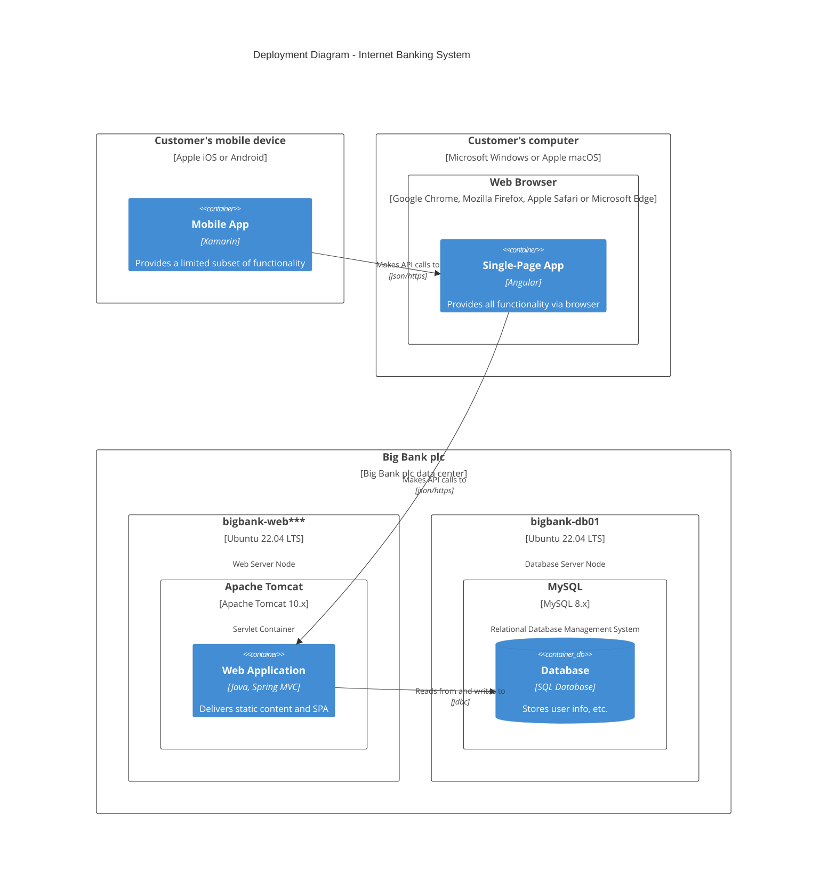

# C4 Model Diagrams Guide

The **C4 model** (Context, Container, Component, and Code) is an "abstractions-first" approach to software architecture. Mermaid provides specialized syntax for C4 diagrams that follow the official C4 model styling.

---

## 1. C4 Context Diagram (L1)

**Purpose:** Show the system boundary and how it fits in its environment.

---

## 2. C4 Container Diagram (L2)

**Purpose:** Show the major runtime containers (applications, databases, services) that make up the system.

---

## 3. C4 Component Diagram (L3)

**Purpose:** Zoom into a single container to show its internal components.

---

## 4. C4 Dynamic Diagram (Behavioral)

**Purpose:** Show how components in a C4 model interact at runtime (similar to sequence diagram but using C4 elements).

---

## 5. C4 Deployment Diagram (L4V)

**Purpose:** Show how containers are mapped to infrastructure.

---

## Layout Optimization & Best Practices

To ensure C4 diagrams are readable and well-organized, follow these layout optimization strategies:

### 1. Avoid Deep Boundary Nesting
Deeply nesting `System_Boundary` or `Container_Boundary` inside another `Container_Boundary` often breaks the Mermaid layout engine. This can cause the engine to ignore directional hints and clump components in unpredictable ways.
**Strategy:** Flatten boundaries where possible to improve readability.

### 2. Definition Order and Ranking
The Sugiyama layout algorithm (used by Mermaid) treats nodes defined at the top of the `.mmd` file as "Upper Rank".
**Strategy:** To prevent downstream systems (Databases, External APIs) from floating to the top, define your internal components first and external/downstream systems later in the file.

### 3. Directional Hints vs. Ranking Logic
Directional hints like `Rel_D`, `Rel_L`, `Rel_R`, and `Rel_U` are suggestions, not strict commands. If internal ranking logic or boundary constraints contradict them, the hints may be ignored.
**Strategy:** Use `Rel_D` sparingly, primarily for terminal "Sink" nodes like databases or logging services. Rely on definition order for general flow.

### 4. Semantic Clustering
Don't try to model exact spatial geometry. Instead, group components by their functional role.
**Strategy:** Place related middleware or services in a logical sequence to create a clear "functional heatmap" of the system.

### 5. Visual Focus with Styles
Standard blue boxes can lead to "wall of blue" fatigue in complex diagrams. 
**Strategy:** Use `UpdateElementStyle` to apply distinct colors (e.g., Light Green for new features) to guide the reader's eye to high-priority areas.

### 6. "T-Shape" Flow vs. "Star" Flow
Avoid "Star" patterns where a central component has 5+ outgoing arrows, which leads to excessive line crossing.
**Strategy:** Prefer a vertical "Pipeline" for main processing flows and horizontal "Branches" for external integrations.

### 7. Text Conciseness
Overloading technical descriptions inside component boxes forces the layout engine to widen the boxes, stretching the entire diagram.
**Strategy:** Keep "Technology" and "Description" fields concise. Move deep technical details to the surrounding Markdown text rather than the diagram itself.

---

## General Tips

1. **Use Specialized Macros:** Use `Person()`, `System()`, `Container()`, `Component()` instead of generic nodes.
2. **Include Technology Stack:** Always specify technology in the third parameter (e.g., `"Java, Spring Boot"`).
3. **Boundary Clarity:** Use `System_Boundary()` and `Container_Boundary()` to group related items.
4. **Relationship Details:** Use the third and fourth parameters of `Rel()` to specify the action and protocol.

---

**Related Guides:**
- [Architecture Diagrams](./architecture-diagrams.md) - High-level conceptual views
- [Deployment Diagrams](./deployment-diagrams.md) - Infrastructure mapping
- [Unicode Symbols](../unicode-symbols/guide.md) - Complete symbol reference
