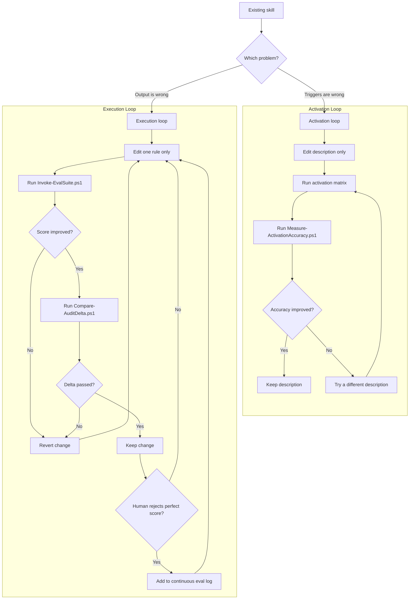

# Dual-Loop Workflow

Use this workflow to improve a skill without mixing trigger tuning and output tuning into one blurry loop.

## Layer map

| Layer | Artifact | What it controls | Main score |
|---|---|---|---|
| Activation | `SKILL.md` frontmatter `description` | whether the skill triggers on the right prompt | false positive and false negative rate |
| Execution | `SKILL.md` body plus referenced files | what the skill produces after it triggers | binary assertion score |

## Operating rule

Freeze one layer while optimizing the other.

- Activation loop: edit only the `description`
- Execution loop: edit only the body, references, or output templates

## Activation loop

1. Copy `assets/activation-matrix-template.md`.
2. Fill it with prompts that should trigger and prompts that should not trigger.
3. Measure where the current description fails.
4. Run the activation audit: `pwsh -NoProfile -File scripts/Measure-ActivationAccuracy.ps1 -SkillDir <target>` to capture baseline.
5. Rewrite the description with more precise triggers and exclusions.
6. Re-run the same prompt matrix and activation audit.
7. Verify improvement: `pwsh -NoProfile -File scripts/Compare-AuditDelta.ps1 -BeforeReport before.json -AfterReport after.json`. Keep the new description only if accuracy improves with no regressions.

### Activation heuristics

- Add concrete user language, not taxonomy terms.
- Name file types, artifacts, or workflow nouns if those are the true triggers.
- Add explicit near-neighbor exclusions if a broader skill often wins by mistake.
- Stop once the description is specific enough; do not stuff execution policy into it.

## Execution loop

1. Copy `assets/eval-template.json` to `evals/eval.json`.
2. Translate output quality goals into binary assertions.
3. Separate subjective requirements into a human review list.
4. Run the structural audit: `pwsh -NoProfile -File scripts/Test-SkillStructure.ps1 -SkillDir <target>`.
5. Run the execution audit to capture baseline: `pwsh -NoProfile -File scripts/Invoke-EvalSuite.ps1 -SkillDir <target> -OutputSamplesDir <target>/evals/samples`.
6. Make one rule change in `SKILL.md` or a referenced file.
7. Re-run the eval suite after the change.
8. Verify improvement: `pwsh -NoProfile -File scripts/Compare-AuditDelta.ps1 -BeforeReport before.json -AfterReport after.json`. Keep the change only if score improves with no regressions.
9. Revert the change if the score drops or if new conflicts appear.
10. Log human-rejected perfect scores in the continuous eval log.

## Guardrails

- Change one rule at a time.
- Keep the prompt set and eval set stable while comparing iterations.
- Pair brevity checks with completeness checks.
- Prefer a smaller high-signal suite over a long brittle suite.
- Stop if the loop starts optimizing around the assertions instead of the real goal.

## Stop conditions

Stop the activation loop when:

- false positives and false negatives stop improving
- the description becomes overly narrow
- the remaining misses are acceptable or runtime-specific

Stop the execution loop when:

- scores plateau for several single-rule edits
- two assertions conflict
- human review keeps rejecting perfect scores for semantic reasons

In those cases, simplify the suite, add better instrumentation, or move the missing dimension back to human review.

## Continuous learning

Every human-rejected perfect score is useful data.

Record:

- the prompt or case ID
- the structural score
- why the human still rejected it
- the candidate new assertion
- whether the candidate should remain human-reviewed instead

Use the log to evolve the suite gradually instead of guessing.

## Diagram

