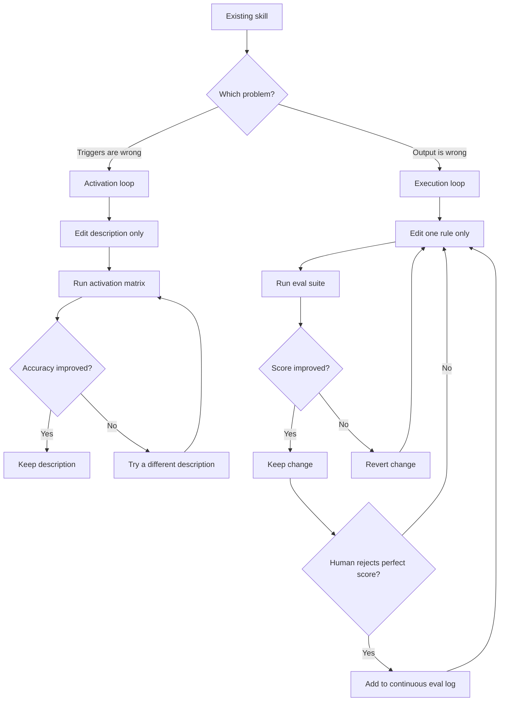

# Dual-Loop Workflow

Use this workflow to improve a skill without mixing trigger tuning and output tuning into one blurry loop.

## Layer map

| Layer | Artifact | What it controls | Main score |
|---|---|---|---|
| Activation | `SKILL.md` frontmatter `description` | whether the skill triggers on the right prompt | false positive and false negative rate |
| Execution | `SKILL.md` body plus referenced files | what the skill produces after it triggers | binary assertion score |

## Operating rule

Freeze one layer while optimizing the other.

- Activation loop: edit only the `description`
- Execution loop: edit only the body, references, or output templates

## Activation loop

1. Copy `assets/activation-matrix-template.md`.
2. Fill it with prompts that should trigger and prompts that should not trigger.
3. Measure where the current description fails.
4. Rewrite the description with more precise triggers and exclusions.
5. Re-run the same prompt matrix.
6. Keep the new description only if the error rate improves.

### Activation heuristics

- Add concrete user language, not taxonomy terms.
- Name file types, artifacts, or workflow nouns if those are the true triggers.
- Add explicit near-neighbor exclusions if a broader skill often wins by mistake.
- Stop once the description is specific enough; do not stuff execution policy into it.

## Execution loop

1. Copy `assets/eval-template.json` to `evals/eval.json`.
2. Translate output quality goals into binary assertions.
3. Separate subjective requirements into a human review list.
4. Make one rule change in `SKILL.md` or a referenced file.
5. Re-run the eval suite.
6. Keep the change if the score improves.
7. Revert the change if the score drops or if new conflicts appear.
8. Log human-rejected perfect scores in the continuous eval log.

## Guardrails

- Change one rule at a time.
- Keep the prompt set and eval set stable while comparing iterations.
- Pair brevity checks with completeness checks.
- Prefer a smaller high-signal suite over a long brittle suite.
- Stop if the loop starts optimizing around the assertions instead of the real goal.

## Stop conditions

Stop the activation loop when:

- false positives and false negatives stop improving
- the description becomes overly narrow
- the remaining misses are acceptable or runtime-specific

Stop the execution loop when:

- scores plateau for several single-rule edits
- two assertions conflict
- human review keeps rejecting perfect scores for semantic reasons

In those cases, simplify the suite, add better instrumentation, or move the missing dimension back to human review.

## Continuous learning

Every human-rejected perfect score is useful data.

Record:

- the prompt or case ID
- the structural score
- why the human still rejected it
- the candidate new assertion
- whether the candidate should remain human-reviewed instead

Use the log to evolve the suite gradually instead of guessing.

## Diagram

