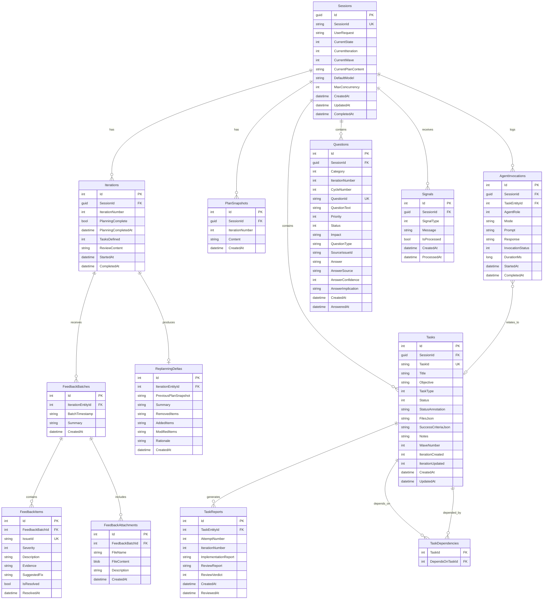

# Ralph V2 .NET — Database Schema (EF Core + SQLite)

> Normalized relational schema for durable persistence of all Ralph V2 session artifacts. Replaces file-based artifact storage with EF Core + SQLite.

---

## Table of Contents

- [Design Rationale](#design-rationale)
- [ER Diagram](#er-diagram)
- [Entity Definitions](#entity-definitions)
- [Enums](#enums)
- [DbContext](#dbcontext)
- [Tool → Repository Mapping](#tool--repository-mapping)
- [Data Access Patterns](#data-access-patterns)
- [Migration Strategy](#migration-strategy)

---

## Design Rationale

### Why Move from Files to SQLite?

| Concern                    | File-Based                                  | SQLite + EF Core                    |
| -------------------------- | ------------------------------------------- | ----------------------------------- |
| **Parsing**                | YAML frontmatter + Markdown body with regex | Strongly-typed C# entities          |
| **Queries**                | Scan directories, read each file            | LINQ queries with indexes           |
| **Atomicity**              | Multiple file writes ≠ atomic               | Single transaction                  |
| **Concurrency**            | File locks, race conditions                 | SQLite WAL mode                     |
| **Schema evolution**       | Manual format migration                     | EF Core migrations                  |
| **Agent tool reliability** | LLM must produce valid Markdown format      | Tools enforce schema via parameters |
| **Cross-session queries**  | Walk multiple directories                   | Single DB query                     |

### What Stays on File System?

The SQLite database stores **orchestration state** (sessions, tasks, plans, reports, signals). These are the "shared artifacts" that agents and orchestrator coordinate through.

**Workspace files** (source code, test files, build outputs) that the Executor/Reviewer work on remain on the file system. Agents still use `ReadFile`/`WriteFile`/`RunCommand` for workspace interactions.

### Database Location

```
.ralph-sessions/ralph.db          ← Single database for all sessions
```

---

## ER Diagram



---

## Enums

```csharp
namespace RalphV2.Console.Data.Enums;

public enum OrchestratorState
{
    Initializing,
    Planning,
    Batching,
    ExecutingBatch,
    ReviewingBatch,
    SessionReview,
    Complete,
    Replanning,
    AwaitingFeedback,
    Paused,
    Stopped
}

public enum TaskItemStatus
{
    NotStarted,      // [ ]
    InProgress,      // [/]
    ReviewPending,   // [P]
    Completed,       // [x]
    Failed,          // [F]
    Cancelled        // [C]
}

public enum TaskItemType
{
    Sequential,
    Parallelizable
}

public enum AgentRole
{
    Planner,
    Questioner,
    Executor,
    Reviewer
}

public enum QuestionCategory
{
    Technical,
    Requirements,
    Constraints,
    Assumptions,
    Risks,
    FeedbackDriven
}

public enum QuestionPriority
{
    Low,
    Medium,
    High
}

public enum QuestionStatus
{
    Unanswered,
    Answered,
    ResearchNeeded
}

public enum ConfidenceLevel
{
    Low,
    Medium,
    High
}

public enum FeedbackSeverity
{
    Critical,
    Quality,
    NewRequirement
}

public enum ReviewVerdict
{
    Qualified,
    Failed
}

public enum SignalType
{
    Steer,
    Pause,
    Stop,
    Info
}

public enum InvocationStatus
{
    Started,
    Completed,
    Failed,
    Cancelled
}
```

---

## Entity Definitions

### Session

```csharp
namespace RalphV2.Console.Data.Entities;

public class Session
{
    public Guid Id { get; set; }
    public required string SessionId { get; set; }       // Human-readable, unique
    public required string UserRequest { get; set; }
    public OrchestratorState CurrentState { get; set; }
    public int CurrentIteration { get; set; } = 1;
    public int? CurrentWave { get; set; }
    public string? CurrentPlanContent { get; set; }      // Mutable current plan
    public string DefaultModel { get; set; } = "gpt-5";
    public int MaxConcurrency { get; set; } = 2;
    public DateTime CreatedAt { get; set; }
    public DateTime UpdatedAt { get; set; }
    public DateTime? CompletedAt { get; set; }

    // Navigation properties
    public ICollection<Iteration> Iterations { get; set; } = [];
    public ICollection<PlanSnapshot> PlanSnapshots { get; set; } = [];
    public ICollection<TaskItem> Tasks { get; set; } = [];
    public ICollection<Question> Questions { get; set; } = [];
    public ICollection<Signal> Signals { get; set; } = [];
    public ICollection<AgentInvocation> AgentInvocations { get; set; } = [];
}
```

### Iteration

```csharp
public class Iteration
{
    public int Id { get; set; }
    public Guid SessionId { get; set; }
    public int IterationNumber { get; set; }
    public bool PlanningComplete { get; set; }
    public DateTime? PlanningCompletedAt { get; set; }
    public int TasksDefined { get; set; }
    public string? ReviewContent { get; set; }           // iterations/N/review.md content
    public DateTime StartedAt { get; set; }
    public DateTime? CompletedAt { get; set; }

    // Navigation properties
    public Session Session { get; set; } = null!;
    public ICollection<FeedbackBatch> FeedbackBatches { get; set; } = [];
    public ReplanningDelta? ReplanningDelta { get; set; }
}
```

### PlanSnapshot

```csharp
public class PlanSnapshot
{
    public int Id { get; set; }
    public Guid SessionId { get; set; }
    public int IterationNumber { get; set; }             // plan.iteration-N.md
    public required string Content { get; set; }
    public DateTime CreatedAt { get; set; }

    // Navigation
    public Session Session { get; set; } = null!;
}
```

### TaskItem

> Named `TaskItem` to avoid collision with `System.Threading.Tasks.Task`.

```csharp
public class TaskItem
{
    public int Id { get; set; }
    public Guid SessionId { get; set; }
    public required string TaskId { get; set; }          // "task-1", "task-2", etc.
    public required string Title { get; set; }
    public required string Objective { get; set; }
    public TaskItemType TaskType { get; set; }
    public TaskItemStatus Status { get; set; }
    public string? StatusAnnotation { get; set; }        // "(Attempt 2, Iteration 1)"
    public string? FilesJson { get; set; }               // JSON array of target files
    public string? SuccessCriteriaJson { get; set; }     // JSON array of criteria strings
    public string? Notes { get; set; }
    public int? WaveNumber { get; set; }
    public int IterationCreated { get; set; }
    public int IterationUpdated { get; set; }
    public DateTime CreatedAt { get; set; }
    public DateTime UpdatedAt { get; set; }

    // Navigation
    public Session Session { get; set; } = null!;
    public ICollection<TaskReport> Reports { get; set; } = [];
    public ICollection<TaskDependency> DependsOn { get; set; } = [];
    public ICollection<TaskDependency> DependedBy { get; set; } = [];
    public ICollection<AgentInvocation> AgentInvocations { get; set; } = [];
}
```

### TaskDependency

```csharp
public class TaskDependency
{
    public int TaskItemId { get; set; }
    public int DependsOnTaskItemId { get; set; }

    // Navigation
    public TaskItem TaskItem { get; set; } = null!;
    public TaskItem DependsOnTaskItem { get; set; } = null!;
}
```

### TaskReport

```csharp
public class TaskReport
{
    public int Id { get; set; }
    public int TaskItemId { get; set; }
    public int AttemptNumber { get; set; }
    public int IterationNumber { get; set; }
    public required string ImplementationReport { get; set; }  // PART 1 (Executor)
    public string? ReviewReport { get; set; }                  // PART 2 (Reviewer)
    public ReviewVerdict? ReviewVerdict { get; set; }
    public DateTime CreatedAt { get; set; }
    public DateTime? ReviewedAt { get; set; }

    // Navigation
    public TaskItem TaskItem { get; set; } = null!;
}
```

### Question

```csharp
public class Question
{
    public int Id { get; set; }
    public Guid SessionId { get; set; }
    public QuestionCategory Category { get; set; }
    public int IterationNumber { get; set; }
    public int CycleNumber { get; set; }
    public required string QuestionId { get; set; }       // "Q-TECH-001"
    public required string QuestionText { get; set; }
    public QuestionPriority Priority { get; set; }
    public QuestionStatus Status { get; set; }
    public string? Impact { get; set; }
    public string? QuestionType { get; set; }             // "Root Cause", "Solution", etc.
    public string? SourceIssueId { get; set; }            // For feedback-driven: "ISS-001"
    public string? Answer { get; set; }
    public string? AnswerSource { get; set; }
    public ConfidenceLevel? AnswerConfidence { get; set; }
    public string? AnswerImplication { get; set; }
    public DateTime CreatedAt { get; set; }
    public DateTime? AnsweredAt { get; set; }

    // Navigation
    public Session Session { get; set; } = null!;
}
```

### FeedbackBatch

```csharp
public class FeedbackBatch
{
    public int Id { get; set; }
    public int IterationId { get; set; }
    public required string BatchTimestamp { get; set; }   // "20260209-143000"
    public string? Summary { get; set; }
    public DateTime CreatedAt { get; set; }

    // Navigation
    public Iteration Iteration { get; set; } = null!;
    public ICollection<FeedbackItem> Items { get; set; } = [];
    public ICollection<FeedbackAttachment> Attachments { get; set; } = [];
}
```

### FeedbackItem

```csharp
public class FeedbackItem
{
    public int Id { get; set; }
    public int FeedbackBatchId { get; set; }
    public required string IssueId { get; set; }         // "ISS-001", "Q-001"
    public FeedbackSeverity Severity { get; set; }
    public required string Description { get; set; }
    public string? Evidence { get; set; }
    public string? SuggestedFix { get; set; }
    public bool IsResolved { get; set; }
    public DateTime? ResolvedAt { get; set; }

    // Navigation
    public FeedbackBatch FeedbackBatch { get; set; } = null!;
}
```

### FeedbackAttachment

```csharp
public class FeedbackAttachment
{
    public int Id { get; set; }
    public int FeedbackBatchId { get; set; }
    public required string FileName { get; set; }
    public byte[] FileContent { get; set; } = [];
    public string? Description { get; set; }
    public DateTime CreatedAt { get; set; }

    // Navigation
    public FeedbackBatch FeedbackBatch { get; set; } = null!;
}
```

### ReplanningDelta

```csharp
public class ReplanningDelta
{
    public int Id { get; set; }
    public int IterationId { get; set; }
    public string? PreviousPlanSnapshotRef { get; set; } // "plan.iteration-1"
    public string? Summary { get; set; }
    public string? RemovedItems { get; set; }            // Markdown content
    public string? AddedItems { get; set; }
    public string? ModifiedItems { get; set; }
    public string? Rationale { get; set; }
    public DateTime CreatedAt { get; set; }

    // Navigation
    public Iteration Iteration { get; set; } = null!;
}
```

### Signal

```csharp
public class Signal
{
    public int Id { get; set; }
    public Guid SessionId { get; set; }
    public SignalType SignalType { get; set; }
    public string? Message { get; set; }
    public bool IsProcessed { get; set; }
    public DateTime CreatedAt { get; set; }
    public DateTime? ProcessedAt { get; set; }

    // Navigation
    public Session Session { get; set; } = null!;
}
```

### AgentInvocation

```csharp
public class AgentInvocation
{
    public int Id { get; set; }
    public Guid SessionId { get; set; }
    public int? TaskItemId { get; set; }                 // Null for planning invocations
    public AgentRole AgentRole { get; set; }
    public string? Mode { get; set; }                    // "INITIALIZE", "brainstorm", etc.
    public required string Prompt { get; set; }
    public string? Response { get; set; }
    public InvocationStatus InvocationStatus { get; set; }
    public long? DurationMs { get; set; }
    public DateTime StartedAt { get; set; }
    public DateTime? CompletedAt { get; set; }

    // Navigation
    public Session Session { get; set; } = null!;
    public TaskItem? TaskItem { get; set; }
}
```

---

## DbContext

```csharp
using Microsoft.EntityFrameworkCore;

namespace RalphV2.Console.Data;

public class RalphDbContext(DbContextOptions<RalphDbContext> options) : DbContext(options)
{
    public DbSet<Session> Sessions => Set<Session>();
    public DbSet<Iteration> Iterations => Set<Iteration>();
    public DbSet<PlanSnapshot> PlanSnapshots => Set<PlanSnapshot>();
    public DbSet<TaskItem> Tasks => Set<TaskItem>();
    public DbSet<TaskDependency> TaskDependencies => Set<TaskDependency>();
    public DbSet<TaskReport> TaskReports => Set<TaskReport>();
    public DbSet<Question> Questions => Set<Question>();
    public DbSet<FeedbackBatch> FeedbackBatches => Set<FeedbackBatch>();
    public DbSet<FeedbackItem> FeedbackItems => Set<FeedbackItem>();
    public DbSet<FeedbackAttachment> FeedbackAttachments => Set<FeedbackAttachment>();
    public DbSet<ReplanningDelta> ReplanningDeltas => Set<ReplanningDelta>();
    public DbSet<Signal> Signals => Set<Signal>();
    public DbSet<AgentInvocation> AgentInvocations => Set<AgentInvocation>();

    protected override void OnModelCreating(ModelBuilder modelBuilder)
    {
        // Session
        modelBuilder.Entity<Session>(e =>
        {
            e.HasKey(s => s.Id);
            e.HasIndex(s => s.SessionId).IsUnique();
            e.Property(s => s.CurrentState).HasConversion<int>();
            e.Property(s => s.CurrentPlanContent).HasColumnType("TEXT");
        });

        // Iteration
        modelBuilder.Entity<Iteration>(e =>
        {
            e.HasKey(i => i.Id);
            e.HasIndex(i => new { i.SessionId, i.IterationNumber }).IsUnique();
            e.Property(i => i.ReviewContent).HasColumnType("TEXT");
            e.HasOne(i => i.Session)
             .WithMany(s => s.Iterations)
             .HasForeignKey(i => i.SessionId);
        });

        // PlanSnapshot
        modelBuilder.Entity<PlanSnapshot>(e =>
        {
            e.HasKey(p => p.Id);
            e.HasIndex(p => new { p.SessionId, p.IterationNumber }).IsUnique();
            e.Property(p => p.Content).HasColumnType("TEXT");
            e.HasOne(p => p.Session)
             .WithMany(s => s.PlanSnapshots)
             .HasForeignKey(p => p.SessionId);
        });

        // TaskItem
        modelBuilder.Entity<TaskItem>(e =>
        {
            e.HasKey(t => t.Id);
            e.HasIndex(t => new { t.SessionId, t.TaskId }).IsUnique();
            e.Property(t => t.TaskType).HasConversion<int>();
            e.Property(t => t.Status).HasConversion<int>();
            e.Property(t => t.FilesJson).HasColumnType("TEXT");
            e.Property(t => t.SuccessCriteriaJson).HasColumnType("TEXT");
            e.HasOne(t => t.Session)
             .WithMany(s => s.Tasks)
             .HasForeignKey(t => t.SessionId);
        });

        // TaskDependency (composite PK)
        modelBuilder.Entity<TaskDependency>(e =>
        {
            e.HasKey(d => new { d.TaskItemId, d.DependsOnTaskItemId });
            e.HasOne(d => d.TaskItem)
             .WithMany(t => t.DependsOn)
             .HasForeignKey(d => d.TaskItemId)
             .OnDelete(DeleteBehavior.Restrict);
            e.HasOne(d => d.DependsOnTaskItem)
             .WithMany(t => t.DependedBy)
             .HasForeignKey(d => d.DependsOnTaskItemId)
             .OnDelete(DeleteBehavior.Restrict);
        });

        // TaskReport
        modelBuilder.Entity<TaskReport>(e =>
        {
            e.HasKey(r => r.Id);
            e.HasIndex(r => new { r.TaskItemId, r.AttemptNumber }).IsUnique();
            e.Property(r => r.ImplementationReport).HasColumnType("TEXT");
            e.Property(r => r.ReviewReport).HasColumnType("TEXT");
            e.Property(r => r.ReviewVerdict).HasConversion<int?>();
            e.HasOne(r => r.TaskItem)
             .WithMany(t => t.Reports)
             .HasForeignKey(r => r.TaskItemId);
        });

        // Question
        modelBuilder.Entity<Question>(e =>
        {
            e.HasKey(q => q.Id);
            e.HasIndex(q => new { q.SessionId, q.QuestionId }).IsUnique();
            e.Property(q => q.Category).HasConversion<int>();
            e.Property(q => q.Priority).HasConversion<int>();
            e.Property(q => q.Status).HasConversion<int>();
            e.Property(q => q.AnswerConfidence).HasConversion<int?>();
            e.HasOne(q => q.Session)
             .WithMany(s => s.Questions)
             .HasForeignKey(q => q.SessionId);
        });

        // FeedbackBatch
        modelBuilder.Entity<FeedbackBatch>(e =>
        {
            e.HasKey(f => f.Id);
            e.HasOne(f => f.Iteration)
             .WithMany(i => i.FeedbackBatches)
             .HasForeignKey(f => f.IterationId);
        });

        // FeedbackItem
        modelBuilder.Entity<FeedbackItem>(e =>
        {
            e.HasKey(f => f.Id);
            e.HasIndex(f => new { f.FeedbackBatchId, f.IssueId }).IsUnique();
            e.Property(f => f.Severity).HasConversion<int>();
            e.HasOne(f => f.FeedbackBatch)
             .WithMany(b => b.Items)
             .HasForeignKey(f => f.FeedbackBatchId);
        });

        // FeedbackAttachment
        modelBuilder.Entity<FeedbackAttachment>(e =>
        {
            e.HasKey(a => a.Id);
            e.HasOne(a => a.FeedbackBatch)
             .WithMany(b => b.Attachments)
             .HasForeignKey(a => a.FeedbackBatchId);
        });

        // ReplanningDelta (1:1 with Iteration)
        modelBuilder.Entity<ReplanningDelta>(e =>
        {
            e.HasKey(r => r.Id);
            e.HasIndex(r => r.IterationId).IsUnique();
            e.HasOne(r => r.Iteration)
             .WithOne(i => i.ReplanningDelta)
             .HasForeignKey<ReplanningDelta>(r => r.IterationId);
        });

        // Signal
        modelBuilder.Entity<Signal>(e =>
        {
            e.HasKey(s => s.Id);
            e.HasIndex(s => new { s.SessionId, s.IsProcessed });
            e.Property(s => s.SignalType).HasConversion<int>();
            e.HasOne(s => s.Session)
             .WithMany(ses => ses.Signals)
             .HasForeignKey(s => s.SessionId);
        });

        // AgentInvocation
        modelBuilder.Entity<AgentInvocation>(e =>
        {
            e.HasKey(a => a.Id);
            e.Property(a => a.AgentRole).HasConversion<int>();
            e.Property(a => a.InvocationStatus).HasConversion<int>();
            e.Property(a => a.Prompt).HasColumnType("TEXT");
            e.Property(a => a.Response).HasColumnType("TEXT");
            e.HasOne(a => a.Session)
             .WithMany(s => s.AgentInvocations)
             .HasForeignKey(a => a.SessionId);
            e.HasOne(a => a.TaskItem)
             .WithMany(t => t.AgentInvocations)
             .HasForeignKey(a => a.TaskItemId)
             .IsRequired(false);
        });
    }
}
```

### DI Registration

```csharp
// In Startup.cs
services.AddDbContext<RalphDbContext>(options =>
{
    var dbPath = Path.Combine(
        configuration["Ralph:SessionsDirectory"] ?? ".ralph-sessions",
        "ralph.db");
    Directory.CreateDirectory(Path.GetDirectoryName(dbPath)!);
    options.UseSqlite($"Data Source={dbPath}");
});
```

---

## Tool → Repository Mapping

The file-based tools are replaced with **two tool categories**:

### 1. Session Tools (Database-Backed)

These tools interact with session artifacts via EF Core. The orchestrator and agents use these to coordinate workflow state.

| Old File-Based Tool             | New Session Tool                          | DB Table                            | Used By            |
| ------------------------------- | ----------------------------------------- | ----------------------------------- | ------------------ |
| `ReadFile(plan.md)`             | `GetPlan(sessionId)`                      | `Sessions.CurrentPlanContent`       | All                |
| `WriteFile(plan.md, ...)`       | `UpdatePlan(sessionId, content)`          | `Sessions.CurrentPlanContent`       | Planner            |
| `ReadFile(tasks/task-*.md)`     | `GetTask(sessionId, taskId)`              | `Tasks`                             | All                |
| `WriteFile(tasks/task-*.md)`    | `CreateTask(sessionId, ...)`              | `Tasks` + `TaskDependencies`        | Planner            |
| `ReadFile(progress.md)` → parse | `GetProgress(sessionId)`                  | `Tasks` (computed from Status)      | All                |
| `Update progress.md`            | `UpdateTaskStatus(taskId, status)`        | `Tasks.Status`                      | Orchestrator       |
| `WriteFile(reports/...)`        | `SubmitReport(taskId, report)`            | `TaskReports`                       | Executor           |
| `AppendToFile(reports/...)`     | `SubmitReview(reportId, review, verdict)` | `TaskReports`                       | Reviewer           |
| `ReadFile(questions/...)`       | `GetQuestions(sessionId, category)`       | `Questions`                         | All                |
| `WriteFile(questions/...)`      | `CreateQuestion(sessionId, ...)`          | `Questions`                         | Questioner         |
| —                               | `AnswerQuestion(questionId, answer, ...)` | `Questions`                         | Questioner         |
| `ReadFile(feedbacks/...)`       | `GetFeedback(sessionId, iteration)`       | `FeedbackBatches` + `FeedbackItems` | All                |
| Signal file I/O                 | `CreateSignal(...)` / `PollSignal(...)`   | `Signals`                           | Orchestrator + CLI |

### 2. Workspace Tools (File-System)

These tools interact with the actual workspace/codebase. Unchanged from the original design.

| Tool                          | Purpose                    | Used By            |
| ----------------------------- | -------------------------- | ------------------ |
| `ReadFile(path)`              | Read source code, configs  | Executor, Reviewer |
| `WriteFile(path, content)`    | Write source code, configs | Executor           |
| `ListDirectory(path)`         | Browse project structure   | Executor, Reviewer |
| `SearchInFiles(pattern, dir)` | Code search                | Executor, Reviewer |
| `RunCommand(cmd)`             | Build, test, lint          | Executor, Reviewer |
| `WebSearch(query)`            | Research                   | Questioner         |
| `FetchWebPage(url)`           | Read docs                  | Questioner         |

### Session Tool Implementation Pattern

```csharp
public static class SessionTools
{
    public static AIFunction[] CreateTools(RalphDbContext db, Guid sessionId)
    {
        return
        [
            AIFunctionFactory.Create(
                async () =>
                {
                    var session = await db.Sessions.FindAsync(sessionId);
                    return session?.CurrentPlanContent ?? "No plan exists yet.";
                },
                "GetPlan",
                "Get the current session plan content"
            ),

            AIFunctionFactory.Create(
                async ([Description("Updated plan content")] string content) =>
                {
                    var session = await db.Sessions.FindAsync(sessionId);
                    if (session is null) return "Error: Session not found";
                    session.CurrentPlanContent = content;
                    session.UpdatedAt = DateTime.UtcNow;
                    await db.SaveChangesAsync();
                    return "Plan updated successfully.";
                },
                "UpdatePlan",
                "Update the current session plan with new content"
            ),

            AIFunctionFactory.Create(
                async ([Description("Task ID, e.g., 'task-1'")] string taskId) =>
                {
                    var task = await db.Tasks
                        .Include(t => t.DependsOn)
                        .ThenInclude(d => d.DependsOnTaskItem)
                        .FirstOrDefaultAsync(t => t.SessionId == sessionId && t.TaskId == taskId);
                    if (task is null) return $"Error: Task {taskId} not found.";
                    return JsonSerializer.Serialize(new
                    {
                        task.TaskId,
                        task.Title,
                        task.Objective,
                        Type = task.TaskType.ToString(),
                        Status = task.Status.ToString(),
                        Files = JsonSerializer.Deserialize<string[]>(task.FilesJson ?? "[]"),
                        SuccessCriteria = JsonSerializer.Deserialize<string[]>(task.SuccessCriteriaJson ?? "[]"),
                        DependsOn = task.DependsOn.Select(d => d.DependsOnTaskItem.TaskId).ToList(),
                        task.Notes
                    }, new JsonSerializerOptions { WriteIndented = true });
                },
                "GetTask",
                "Get a task definition by its ID"
            ),

            AIFunctionFactory.Create(
                async (
                    [Description("Task ID, e.g., 'task-1'")] string taskId,
                    [Description("Task title")] string title,
                    [Description("Task objective")] string objective,
                    [Description("Task type: Sequential or Parallelizable")] string taskType,
                    [Description("Target files as JSON array")] string filesJson,
                    [Description("Success criteria as JSON array")] string criteriaJson,
                    [Description("Task IDs this depends on, as JSON array")] string dependsOnJson,
                    [Description("Additional notes")] string? notes) =>
                {
                    var taskItem = new TaskItem
                    {
                        SessionId = sessionId,
                        TaskId = taskId,
                        Title = title,
                        Objective = objective,
                        TaskType = Enum.Parse<TaskItemType>(taskType, ignoreCase: true),
                        Status = TaskItemStatus.NotStarted,
                        FilesJson = filesJson,
                        SuccessCriteriaJson = criteriaJson,
                        Notes = notes,
                        IterationCreated = (await db.Sessions.FindAsync(sessionId))!.CurrentIteration,
                        IterationUpdated = (await db.Sessions.FindAsync(sessionId))!.CurrentIteration,
                        CreatedAt = DateTime.UtcNow,
                        UpdatedAt = DateTime.UtcNow
                    };
                    db.Tasks.Add(taskItem);
                    await db.SaveChangesAsync();

                    // Add dependencies
                    var depIds = JsonSerializer.Deserialize<string[]>(dependsOnJson ?? "[]") ?? [];
                    foreach (var depId in depIds)
                    {
                        var depTask = await db.Tasks
                            .FirstOrDefaultAsync(t => t.SessionId == sessionId && t.TaskId == depId);
                        if (depTask is not null)
                        {
                            db.TaskDependencies.Add(new TaskDependency
                            {
                                TaskItemId = taskItem.Id,
                                DependsOnTaskItemId = depTask.Id
                            });
                        }
                    }
                    await db.SaveChangesAsync();
                    return $"Task {taskId} created successfully.";
                },
                "CreateTask",
                "Create a new task definition with dependencies"
            ),

            AIFunctionFactory.Create(
                async () =>
                {
                    var tasks = await db.Tasks
                        .Where(t => t.SessionId == sessionId)
                        .OrderBy(t => t.WaveNumber).ThenBy(t => t.TaskId)
                        .Select(t => new { t.TaskId, t.Title, Status = t.Status.ToString(), t.WaveNumber })
                        .ToListAsync();
                    
                    var summary = tasks.GroupBy(t => t.Status)
                        .ToDictionary(g => g.Key, g => g.Count());
                    
                    return JsonSerializer.Serialize(new { Tasks = tasks, Summary = summary },
                        new JsonSerializerOptions { WriteIndented = true });
                },
                "GetProgress",
                "Get a progress summary of all tasks in the session"
            ),

            AIFunctionFactory.Create(
                async (
                    [Description("Task ID")] string taskId,
                    [Description("Implementation report content (PART 1)")] string report,
                    [Description("Attempt number")] int attemptNumber) =>
                {
                    var task = await db.Tasks
                        .FirstOrDefaultAsync(t => t.SessionId == sessionId && t.TaskId == taskId);
                    if (task is null) return $"Error: Task {taskId} not found.";

                    var session = await db.Sessions.FindAsync(sessionId);
                    db.TaskReports.Add(new TaskReport
                    {
                        TaskItemId = task.Id,
                        AttemptNumber = attemptNumber,
                        IterationNumber = session!.CurrentIteration,
                        ImplementationReport = report,
                        CreatedAt = DateTime.UtcNow
                    });
                    await db.SaveChangesAsync();
                    return $"Report submitted for {taskId} (attempt {attemptNumber}).";
                },
                "SubmitReport",
                "Submit an implementation report (PART 1) for a task"
            ),

            AIFunctionFactory.Create(
                async (
                    [Description("Task ID")] string taskId,
                    [Description("Review content (PART 2)")] string reviewContent,
                    [Description("Verdict: Qualified or Failed")] string verdict) =>
                {
                    var report = await db.TaskReports
                        .Include(r => r.TaskItem)
                        .Where(r => r.TaskItem.SessionId == sessionId && r.TaskItem.TaskId == taskId)
                        .OrderByDescending(r => r.AttemptNumber)
                        .FirstOrDefaultAsync();
                    if (report is null) return $"Error: No report found for {taskId}.";

                    report.ReviewReport = reviewContent;
                    report.ReviewVerdict = Enum.Parse<ReviewVerdict>(verdict, ignoreCase: true);
                    report.ReviewedAt = DateTime.UtcNow;
                    await db.SaveChangesAsync();
                    return $"Review submitted for {taskId}: {verdict}.";
                },
                "SubmitReview",
                "Submit a review (PART 2) with verdict for a task report"
            ),
        ];
    }
}
```

---

## Data Access Patterns

### Orchestrator Uses Repository Directly (No Tools)

The orchestrator uses `RalphDbContext` directly — it doesn't need AI tools since it's deterministic C#.

```csharp
public class OrchestratorStateMachine
{
    private readonly RalphDbContext _db;

    // State transition with atomic DB update
    public async Task TransitionStateAsync(Guid sessionId, OrchestratorState newState)
    {
        var session = await _db.Sessions.FindAsync(sessionId)
            ?? throw new InvalidOperationException($"Session {sessionId} not found");
        session.CurrentState = newState;
        session.UpdatedAt = DateTime.UtcNow;
        await _db.SaveChangesAsync();
    }

    // Wave computation from DB
    public async Task<List<Wave>> ComputeWavesAsync(Guid sessionId)
    {
        var tasks = await _db.Tasks
            .Where(t => t.SessionId == sessionId)
            .Include(t => t.DependsOn)
            .ThenInclude(d => d.DependsOnTaskItem)
            .ToListAsync();
        return WaveComputer.Compute(tasks);
    }

    // Signal polling from DB
    public async Task<Signal?> PollSignalAsync(Guid sessionId)
    {
        var signal = await _db.Signals
            .Where(s => s.SessionId == sessionId && !s.IsProcessed)
            .OrderBy(s => s.CreatedAt)
            .FirstOrDefaultAsync();
        if (signal is not null)
        {
            signal.IsProcessed = true;
            signal.ProcessedAt = DateTime.UtcNow;
            await _db.SaveChangesAsync();
        }
        return signal;
    }

    // Progress summary (replaces progress.md parsing)
    public async Task<ProgressSummary> GetProgressAsync(Guid sessionId)
    {
        var tasks = await _db.Tasks
            .Where(t => t.SessionId == sessionId)
            .GroupBy(t => t.Status)
            .Select(g => new { Status = g.Key, Count = g.Count() })
            .ToDictionaryAsync(g => g.Status, g => g.Count);
        
        return new ProgressSummary(tasks);
    }
}
```

### Agent Tool Scoping with DbContext

Each agent invocation gets a scoped `RalphDbContext`:

```csharp
public AIAgent CreateAgent(AgentRole role, Guid sessionId)
{
    // Create a scoped DbContext for this invocation
    using var scope = _serviceProvider.CreateScope();
    var db = scope.ServiceProvider.GetRequiredService<RalphDbContext>();

    var sessionTools = SessionTools.CreateTools(db, sessionId);
    var workspaceTools = WorkspaceTools.CreateTools(workspacePath);
    var tools = _toolSetFactory.AssembleTools(role, sessionTools, workspaceTools);

    return _clientManager.Client.AsAIAgent(
        instructions: GetSystemPrompt(role),
        tools: tools
    );
}
```

---

## Migration Strategy

### Initial Migration

```powershell
# Install EF Core tools (if not already)
dotnet tool install --global dotnet-ef

# Create initial migration
cd src/RalphV2.Console
dotnet ef migrations add InitialCreate

# Apply migration (auto-applied on startup via EnsureCreated or Migrate)
dotnet ef database update
```

### Auto-Migration on Startup

```csharp
// In Program.cs or Startup.cs
using var scope = app.Services.CreateScope();
var db = scope.ServiceProvider.GetRequiredService<RalphDbContext>();
await db.Database.MigrateAsync();
```

### SQLite Configuration

```csharp
services.AddDbContext<RalphDbContext>(options =>
{
    options.UseSqlite($"Data Source={dbPath}", sqliteOptions =>
    {
        sqliteOptions.CommandTimeout(60);
    });
});
```

### Connection String in appsettings.json

```json
{
  "ConnectionStrings": {
    "Ralph": "Data Source=.ralph-sessions/ralph.db"
  }
}
```

---

## Indexes & Performance

| Table           | Index                                                 | Purpose                          |
| --------------- | ----------------------------------------------------- | -------------------------------- |
| `Sessions`      | `IX_Sessions_SessionId` (unique)                      | Fast lookup by human-readable ID |
| `Iterations`    | `IX_Iterations_SessionId_IterationNumber` (unique)    | One iteration per number         |
| `Tasks`         | `IX_Tasks_SessionId_TaskId` (unique)                  | Fast task lookup within session  |
| `TaskReports`   | `IX_TaskReports_TaskItemId_AttemptNumber` (unique)    | One report per attempt           |
| `Questions`     | `IX_Questions_SessionId_QuestionId` (unique)          | Fast question lookup             |
| `Signals`       | `IX_Signals_SessionId_IsProcessed`                    | Efficient signal polling         |
| `FeedbackItems` | `IX_FeedbackItems_BatchId_IssueId` (unique)           | Unique issues per batch          |
| `PlanSnapshots` | `IX_PlanSnapshots_SessionId_IterationNumber` (unique) | One snapshot per iteration       |
